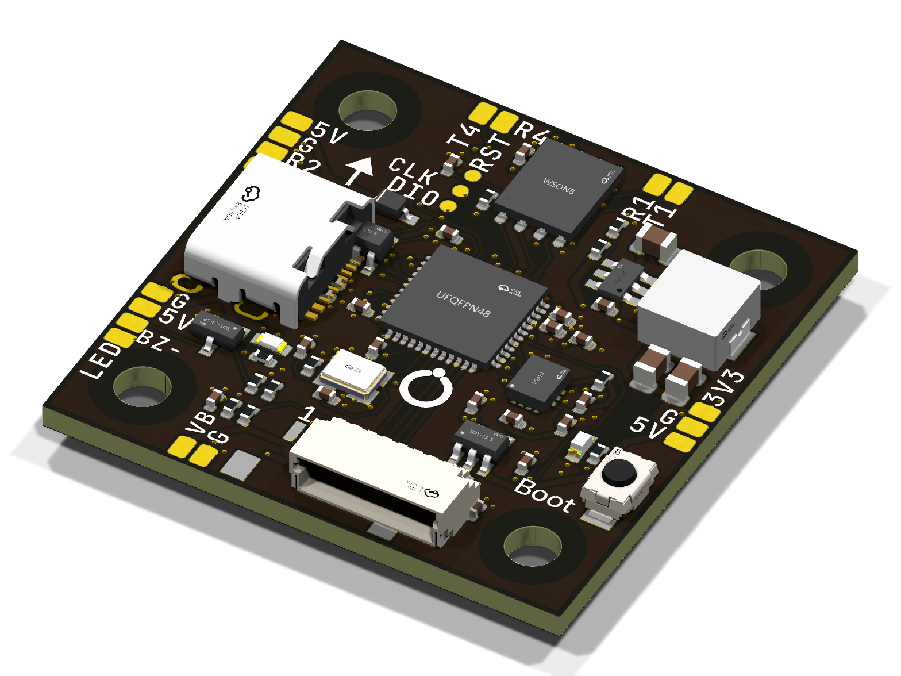

# Cheap Drone stack v1: flight controller + 4-in-1 ESC for the Phase 1 3" quad

Two 33.8 × 33.8 mm boards on the 25.5 mm (M3, or M2 with grommets) pattern.
Together they replace the GEPRC TAKER G4 AIO that Phase 1 flew. They are
drawn for the Phase 1 hardware:

| | Phase 1 part | What this stack does for it |
|---|---|---|
| Motors | iFlight XING2 1404 3800KV (9N12P: 12 magnet poles) | Four AM32 ESCs, 30 V half-bridges, bidirectional DShot for the RPM filter |
| Props | Gemfan 3016 | – |
| Battery | OVONIC 4S 650 mAh, XT30 | 4S only (see [Limits](#limits)); battery pads on the ESC's rear edge |
| Receiver | RadioMaster RP3 ELRS (CRSF, 5 V) | 5 V / G / R2 / T2 pads on the FC's front-left edge, CRSF on UART2 by default |
| Frame | 25.5 mm mount, USB-C out the left side, lead out the back | Same hole pattern, board size, and USB and lead directions as the TAKER G4 |

**Status: designed, not yet built.** Both boards pass KiCad DRC with **zero
errors, zero warnings and zero unconnected items** against JLCPCB's rules
(FC 4 layers, ESC 6 layers). The routed copper was checked pad by pad
against the circuit in `src/circuit.py`, and
[`VERIFICATION.md`](VERIFICATION.md) checks the design against sources other
than itself: the pin maps against KiCad's STM32 libraries and the Betaflight
and AM32 sources, the regulator and divider arithmetic, the fab outputs, and
the silkscreen. **No board has been made or measured yet.** Order the
minimum quantity, assemble one stack, and go through the
[bring-up](#bring-up) steps before building more.



---

## What is on each board

**Flight controller**, `fc/`: all parts on the top side, 53 parts, 4 layers.

- **MCU:** STM32G473CEU6 (170 MHz Cortex-M4). Same MCU and pin map as the
  TAKER G4, so Betaflight's `TAKERG4AIO` target runs it. Use the board's own
  `CHEAPDRONE_G473` build from `firmware/`.
- **Gyro:** ICM-42688-P on SPI1, on its own filtered 3.3 V supply. It is
  mounted square to the board, so the alignment is `CW0` and board rotation
  is 0/0/0.
- **Blackbox:** W25Q128 16 MB flash on SPI2.
- **Power:** 5 V 2 A buck (LMR51420, 36 V input) from the battery, and a
  3.3 V LDO. USB-C alone powers the board for setup.
- **Pads:**
  - UART2 for the receiver.
  - UART4 and UART1 spare (VTX, GPS).
  - 5 V and 3.3 V outputs, a VBAT output for a VTX.
  - LED strip, and buzzer (low-side switched): the left-rear column reads
    `G`, `5V`, `BZ-`, `LED`. The buzzer goes between `5V` (its +) and
    `BZ-`.
  - SWD.
- **Also:** voltage divider for battery monitoring, current input from the
  ESC lead, status LED, and a DFU **BOOT** button.

**4-in-1 ESC**, `esc/`: parts on both sides, 6 layers, 4S.

- **Per motor:**
  - STM32F051K6U6 running AM32 (target `FD6288_F051`).
  - JSM6288Q 3-phase gate driver (pin-for-pin with FD6288Q).
  - Three AON7934 dual N-MOSFET half-bridges (30 V).
  - Back-EMF dividers and a virtual-neutral network.
  - Bulk capacitors directly under the FETs.
- **Layout:**
  - Each channel owns one board edge, and its three half-bridges face their
    motor pads.
  - Motors 2 and 3 are built on the top side, motors 1 and 4 on the bottom.
  - All twelve motor pads are on top, so everything can be soldered with the
    stack assembled.
  - Six layers: signals on the outer layers and on In2 and In3, a solid
    ground plane on In1 and a solid battery plane on In4. Every FET pin
    reaches its plane through a column of vias beside the pin.
  - The bottom channels have their MCU and back-EMF ends swapped, so no
    corner stacks one MCU directly over another. (On four layers, with the
    MCUs back to back, neither router could get the signals out.)
- **Also:**
  - 3.3 V buck for the four MCUs.
  - Shared battery-voltage divider for AM32.
  - SWD pads for each MCU.
  - Vertical 8-pin JST-SH to the FC.

**Stack lead:** JST-SH 1.0 mm, 8 pins, pin 1 to pin 1. This is the FPV
standard pinout: `1 VBAT, 2 GND, 3 CUR, 4 TLM, 5 M1, 6 M2, 7 M3, 8 M4`.

**Motor numbering:** Betaflight's Quad X. Motor 1 is rear-right, 2
front-right, 3 rear-left and 4 front-left. Each motor's three pads on the
ESC carry its number on the silkscreen. The order of the three wires within
a motor does not matter: set the direction in ESC-configurator.

---

## Ordering

Everything to upload is in `fc/production/` and `esc/production/`. You do
not need KiCad or Python.

### Bare boards (JLCPCB or PCBWay)

Upload `cheapdrone-fc-gerbers.zip` and `cheapdrone-esc-gerbers.zip` as two
separate orders. They differ only in layer count:

| Setting | Value |
|---|---|
| Layers | **FC 4, ESC 6** |
| Dimensions | 33.8 × 33.8 mm (read from the outline) |
| Thickness | 1.6 mm |
| Material | FR-4, TG155 or better |
| Solder mask | **Black** (JLCPCB) / **Matte black** (PCBWay): the brand's Pitch ground |
| Silkscreen | **White**: the brand's Bone |
| Surface finish | **ENIG** (the QFN and LGA parts need a flat finish; HASL is a gamble on the 0.5 mm pitch and the gyro) |
| Outer copper | 1 oz |
| Inner copper | **1 oz for the ESC** (its In1/In4 planes carry the motor current); 0.5 oz is fine for the FC |
| Via covering | Tented (the default) |
| Min track / spacing | 0.1 / 0.1 mm (JLCPCB standard multilayer capability) |
| Min via | 0.45 mm pad / 0.25 mm drill |
| Stackup | The fab's standard 1.6 mm build: JLC04161H-7628 for the FC; any standard 6-layer 1.6 mm for the ESC (no impedance control needed) |
| Order number | "Remove" or "specify location". The boards have no free spot reserved for it. |

### Assembly (JLCPCB PCBA)

| | FC | ESC |
|---|---|---|
| Sides | Top only | **Both sides** |
| BOM | `cheapdrone-fc-bom-jlcpcb.csv` | `cheapdrone-esc-bom-jlcpcb.csv` |
| CPL (pick & place) | `cheapdrone-fc-cpl-jlcpcb.csv` | `cheapdrone-esc-cpl-jlcpcb.csv` |

Every part has an LCSC number. All were in stock at JLCPCB when the boards
were designed. Most passives are "basic" parts; the ICs, connectors, FETs
and a few values are "extended".

- **Placement preview:** in JLCPCB's placement preview, check pin 1 of the
  QFN parts and the orientation of the two SH connectors before paying.
  Rotations follow each part's JLCPCB library footprint, so they should need
  no changes.
- **PCBWay:** use `*-bom-pcbway.csv`. It lists the manufacturer part numbers
  and the LCSC numbers, together with the same CPL.
- **Not assembled:** the battery lead, the 470 µF capacitor, motor wires,
  the receiver and the stack cable. These are hand-soldered or plugged in.

### Also needed (not on the boards)

- **Bulk capacitor for the ESC:** 470 µF 35 V low-ESR electrolytic, e.g.
  Panasonic EEU-FR1V471 or any "FPV ESC capacitor". Solder it across BAT+
  and BAT- together with the XT30 lead. **Do not fly without it.** It
  absorbs the voltage spikes that otherwise kill the FETs.
- **XT30 pigtail:** 18 AWG.
- **Stack cable:** 8-pin JST-SH, pin 1 to pin 1. Most 4-in-1 ESCs come with
  one. Check it with a multimeter: VBAT (pin 1) must go to pin 1 at both ends.
- **ST-Link V2** (or clone) to flash the ESC bootloaders once.

---

## Assembly

1. **FC to receiver:** receiver on the FC's front-left pads: `5V`, `G`,
   `R2` to the receiver's TX, `T2` to the receiver's RX.
2. **XT30 lead and capacitor:** onto the ESC's rear-left pads, `+` outer,
   `-` inner. The capacitor goes across the same two pads, observing its
   polarity.
3. **Motor wires:** each motor's three wires to the three pads marked with
   its number.
4. **Flash the ESCs:** do this before stacking, with the battery
   disconnected. See [`firmware/README.md`](firmware/README.md).
5. **Stack:** ESC at the bottom, FC on top, both with the **Front arrow
   forward**. Fit the stack cable.

## Bring-up

Do these in order. Each step catches a fault before it can damage the next.

1. **No power:**
   - Measure BAT+ to BAT- on the ESC. It must not read as a short: the
     meter should climb past a few kΩ as the capacitors charge.
   - Measure the FC's `5V` and `3V3` pads to `G` in the same way.
2. **FC on USB only:**
   - The red power LED lights.
   - Flash Betaflight: hold **BOOT**, plug in USB, and follow
     `firmware/README.md`.
   - Paste `firmware/betaflight/cli-setup.txt` into the CLI.
3. **Orientation, before anything spins.** Phase 1 lost three crashes to a
   wrong board alignment, so check it on the bench, not in the air. In the
   Setup tab:
   - Nose down, and the model goes nose down.
   - Right side down, and the model rolls right.
   - Yaw right, and the model yaws right.
   Then calibrate the accelerometer on a level surface: `acc_calibration`
   should come out as small numbers, not about -4000 (see the Phase 1
   notes).
4. **ESC on a current-limited supply:** 15 V, 0.3 A limit, or use a smoke
   stopper on the battery.
   - It should idle at a few tens of mA.
   - Check the 3.3 V buck at the `3V3` test pad.
5. **Flash the four ESCs:** AM32 bootloader and firmware over SWD, battery
   off. See `firmware/README.md`.
6. **Stack plus battery, props off:**
   - ESC-configurator via Betaflight passthrough must see four AM32 ESCs.
     Set KV 3800 and 12 poles.
   - In Betaflight's Motors tab, spin each motor slowly. Confirm the order
     is 1 rear-right, 2 front-right, 3 rear-left, 4 front-left, and fix the
     directions in ESC-configurator.
   - Check the RPM readout. Bidirectional DShot working means the ESC
     telemetry path is sound.
7. **Props on:** hover test on a leash or in a net first.

## Limits

- **4S only.**
  - Each gate driver runs straight from the pack through 10 Ω. That puts
    12–16.8 V on the FETs' gates, which is inside the driver's range and
    the AON7934's ±20 V gate rating.
  - 3S (9–12.6 V) is near the driver's undervoltage lockout: do not.
  - 5S/6S exceed the FETs' 30 V rating: do not.
- **Current.** The ESC is built for the 1404 3800KV on 4S with 3" props;
  it is not a 35 A-per-motor racing ESC. Its current rating has not been
  measured. From the AON7934 datasheet's maximum on-resistance, conduction
  loss is about 0.45 W per motor at 5 A, 1.8 W at 10 A and 4 W at 15 A (the
  arithmetic is in `VERIFICATION.md`): check FET temperatures during
  bring-up before long full-throttle runs. The ESC has no current sensor.
  Betaflight shows voltage but reports current as 0; `cli-setup.txt` sets
  `current_meter = NONE`.
- **Heat.** The FETs of motors 2 and 3 are on top and those of 1 and 4 on
  the bottom. All of them dump heat into the ground and battery planes.
  Keep the stack in the airflow and do not run full throttle on the bench.

---

## The look

Both boards follow the OffGrid brand hand-off (v3.2). Dark is the brand's
default expression, so the boards are **Pitch** (black solder mask) with
**Bone** type (white silkscreen) and ENIG gold pads.

- The FC's bottom carries the horizontal lockup: the Beacon Ring and
  "OffGrid" in Instrument Sans 600, at the lockup SVG's own proportions.
  Under it sit the company line and what the board is. The top carries the
  bare mark.
- Pad names, part codes and numerals are JetBrains Mono 500, uppercase and
  tracked 0.06 em. Words ("Boot", "Front") are Instrument Sans 500. Both
  follow `tokens.json`.
- Everything is drawn as filled outlines from the fonts in `fonts/` (SIL
  OFL), not KiCad's stroke font. The Gerbers carry the exact letterforms,
  and nobody needs the fonts installed.
- No Ember: silkscreen prints one colour, and the brand's rule is one accent
  or none.

**Black or white, and heat:** mask colour makes almost no difference to how
hot the board runs. Solder mask of any colour emits infrared about equally
well, and the heat leaves through the copper planes and the airflow. White
only helps under direct sun. Black is the brand's default, so both boards
are specified black.

## Why two boards, not one

An all-in-one board (FC and four ESCs on one 33.8 mm square) was checked
first. The parts alone cover about 1,080 mm², over half of both sides.
Every channel would then share its patch of board with the flight
controller's MCU, gyro and flash, on at least six layers. The gyro would
also sit next to the switching FETs. Two boards keep the gyro away from the
power stage and let either board be replaced alone.

---

## Files

```
v1/
  README.md               this file
  VERIFICATION.md         every design check that can be made without
                          hardware, with its result (src/verify.py)
  fc/                     flight controller
    cheapdrone-fc.kicad_pcb / .kicad_pro / .kicad_dru   open in KiCad 10
    production/           gerbers zip, BOM + CPL (JLCPCB), BOM (PCBWay),
                          netlist, assembly drawing (PDF)
    images/               renders
  esc/                    4-in-1 ESC, same layout
  mechanical/             STEP models of both boards (zipped), for frame CAD
  firmware/               Betaflight target + hex, AM32 bootloader + firmware,
                          flashing script, CLI setup
  aio.pretty/ aio.3dshapes/   footprints and 3D models (from JLCPCB/EasyEDA's
                          own library entries for the exact LCSC parts)
  fonts/                  Instrument Sans and JetBrains Mono (SIL OFL), for
                          the silkscreen
  src/                    the design, as Python (see below)
  requirements.txt
```

## How it is made (and how to change it)

The design is the Python in `src/`:

| File | What it holds |
|---|---|
| `circuit.py` | The schematic: every part and every connection, pin by pin, with the reasons. |
| `parts.py` | Every orderable part, with its LCSC number, MPN and footprint. |
| `footprints.py` | Builds `aio.pretty` from the JLCPCB/EasyEDA library entries. |
| `fc_layout.py`, `esc_layout.py` | Placement, power copper, planes and silkscreen. The ESC is one motor channel written once and stamped onto four edges. |
| `route.py`, `fanout.py`, `finish.py` | Plane fan-out, then Freerouting for the signal routing, then an in-house maze router with rip-up to finish the last connections. |
| `artwork.py` | Silkscreen placement: labels go only where they touch no pad, hole, part body or other label. |
| `brand.py` | The OffGrid mark, lockup and type as outlines, from the brand hand-off's numbers. |
| `fab.py` | Gerbers, drills, BOM, CPL, netlist, assembly PDF, renders, STEP. |
| `make.py` | Runs it all with gates. |
| `verify.py` | Writes `VERIFICATION.md`. |

`python3 make.py` rebuilds every output from the committed `.kicad_pcb`
files and fails unless each board has zero DRC errors and zero unconnected
items, the copper matches `circuit.py` pad for pad, and every assembled part
is in the BOM and the CPL. `python3 make.py --reroute` places and routes both
boards from scratch first. Autorouting is not deterministic, so a reroute
gives a different (equally checked) board, not the committed one. The
committed `.kicad_pcb` files are the reference.

The tools: KiCad 10 (`pcbnew` Python module and `kicad-cli`), Freerouting 1.9
(Java, headless via `xvfb-run`), and Python 3.12 with the packages in
`requirements.txt`.
