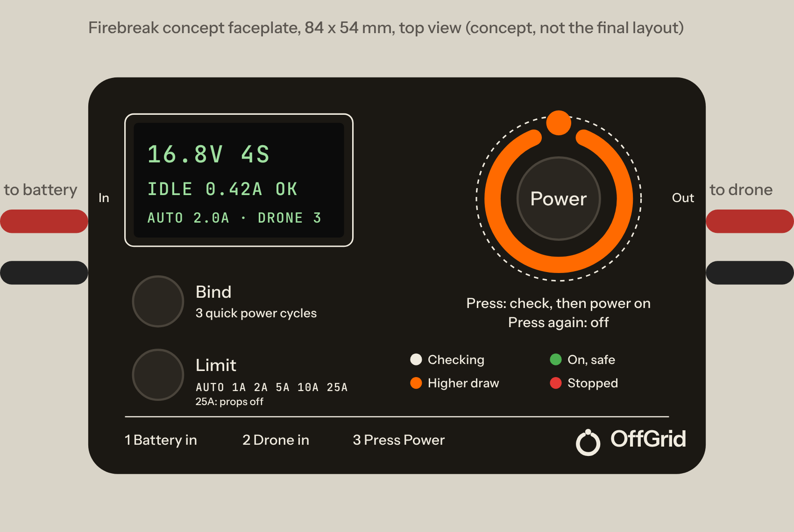

# Firebreak: a smoke stopper that checks before it powers

**Status: spec only.** Nothing is designed or built yet. This document is
what the schematic and the board will be built against. Research behind it
is in [`docs/research/market-and-complaints.md`](docs/research/market-and-complaints.md).
"Firebreak" is a working name.



*Concept only: the final layout comes from the board generator.*

---

## 0. Decisions needed before we build

| # | Decision | Recommendation | Why it matters |
|---|---|---|---|
| D1 | Product name | **Firebreak** (alternatives: Tripwire, Checkpoint) | Needs a trademark search in class 9 before any print run |
| D2 | Top of the voltage range | **12S (52.2 V)**, not 14S | 14S needs 120 V parts and a bigger clamp; 12S covers almost every heavy-lift build sold today |
| D3 | USB-C port | **No** in v1; programming pads only | Saves about $1 and a hole in the case. Firmware is updated at the factory |
| D4 | Front panel | **The PCB is the front panel**, behind a clear cover | The silkscreen instructions are the product's UI and stay on brand |
| D5 | Price | **$24.99** with XT30 and BT2.0 adapters in the box | $19.99 needs 5k-unit volume or dropping the screen (§12) |

---

## 1. What it is

A box that sits between a LiPo and a drone on the bench. Plug both in and
press **Power**. Before any battery voltage reaches the drone, it:

1. **Probes the drone at 3 V** and finds dead shorts, half-shorts and
   **reversed leads** — without a battery's worth of current behind them.
2. **Charges the drone's capacitors slowly**, so there is no inrush and
   nothing to false-trip on.
3. **Turns the drone on** behind a tight electronic fuse, and tells you in
   words what it draws.

It also **remembers each drone** it has seen and warns when one draws more
than last time, or when its big capacitor has shrunk or gone.

One unit covers **1S whoops to 12S heavy-lift**.

## 2. What makes it different

Every smoke stopper today does one thing: apply full voltage and cut off
if current goes over 1 A or 2 A. Users are stuck choosing between false
trips (limit too low) and burnt parts (limit too high). Firebreak removes
that trade-off.

| What people complain about (ranked) | What Firebreak does |
|---|---|
| 1. False trips on healthy builds (inrush, ESC tones, digital VTX) | Soft pre-charge removes inrush entirely. Two-tier limit: a tight *average* limit plus a fast *peak* limit, so ESC tones pass and shorts don't |
| 2. False sense of security: green light, still smoked | 3 V probe finds the fault **before** battery voltage is applied; half-shorts (e.g. a failing 5 V regulator, ~20 Ω) are named and measured |
| 3. Can't spin motors through it | **25 A motor-test setting** (props off), 60 s window, with the peak fuse still armed |
| 4. Only 1 A / 2 A, set with solder pads | Six settings on a button (Auto, 1, 2, 5, 10, 25 A), changeable while on |
| 5. No 1S, nothing smart above 6S | **1S to 12S** in one unit. No smart competitor covers either end |
| 6. Confusing LEDs → "red meant good to go", burnt motor | A screen that says what happened in words, a status ring, beeps, and printed instructions on the face |
| 7. Dead on arrival, bare boards short on benches, leads rip off | Closed case, panel-mount battery connector, clamped drone lead, self-test at power-up |
| 8. XT30/XT60 only; won't reach a frame-mounted XT60 | Flexible 10 cm drone lead; XT30 and BT2.0 adapters in the box |
| Loved feature: the power button for binding | Kept, plus a **Bind** button that does the ELRS three-power-cycle for you |

Three things no product on the market does today:

- **Checks before it powers** (3 V probe: short, reversed, half-short).
- **No inrush, so no false trips**, even with a tight limit.
- **Remembers each drone** and warns when its draw or capacitor changes.

---

## 3. Headline specifications

| | Value |
|---|---|
| Battery | **1S–12S** LiPo, LiHV, Li-ion: **3.5–52.2 V** |
| Survives | Reversed battery to −55 V; 80 V input transients |
| Pre-check | 3 V probe, ≤ 30 mA, before any battery voltage reaches the drone |
| Detects before power | Dead short (< 1 Ω), half-short (1–150 Ω), reversed drone lead, missing bulk capacitor |
| Pre-charge | Controlled ramp, inrush ≤ 1 A, loads up to 5,000 µF |
| Trip settings | Auto · 1 · 2 · 5 · 10 · 25 A (25 A = motor test, 60 s, props off) |
| Peak (short) cut-off | ≤ 5 µs at 4 × the setting; ≤ 1.2 µs hardware short-circuit trip at 60 A |
| Through-resistance | ≤ 15 mΩ battery-to-drone, connectors included |
| Current rating | 10 A continuous, 25 A for 60 s |
| Measures | Battery V (±1 %), drone current 0–40 A; idle current ±10 mA + 2 % (0.05–3 A) |
| Remembers | 32 drones (capacitance, idle current, cell count) |
| Connectors | XT60 panel-mount (battery), 10 cm 14 AWG lead to XT60 (drone). XT30 and BT2.0 adapters in the box |
| UI | 0.96" screen, Beacon Ring status light, 3 buttons, beeper |
| Power use | ~30 mA on, < 30 µA off (battery still plugged in) |
| Size / weight | ~86 × 56 × 22 mm, ~60 g (bench tool; not for flying) |
| Price target | $24.99 retail; ≈ $13 landed cost at 1k |

---

## 4. How it powers a drone

Every press of **Power** runs the whole sequence. Nothing is skipped.

```
 battery in ─► [0 Idle] ─Power─► [1 Probe 3 V] ─pass─► [2 Pre-charge] ─pass─► [3 On]
                                    │ fail                │ fail                 │ over limit
                                    ▼                     ▼                      ▼
                                 [Stopped: reason, value, what to check]  ◄───────┘
```

### Stage 0 — Idle

- Battery detected: screen shows voltage and cell count ("16.8 V · 4S").
- Battery reversed into the device: nothing conducts; screen and beeper
  say "Battery reversed" (powered through the protection diode).
- Cell count is a guess from voltage; it is shown, never acted on silently.

### Stage 1 — 3 V probe (~0.3 s)

The main switch stays **off**. A 3.0 V source drives the drone's power
lead through 1 kΩ, then through 100 Ω. The device reads the drone's
voltage at both currents and the rise time.

| Reading | Verdict |
|---|---|
| Stays below 50 mV at both currents | **Short** (resistance shown) |
| Settles between, scales with the source resistor | **Half-short**, resistance shown (e.g. "18 Ω") |
| Clamps at 0.9–1.6 V and barely moves between the two currents | **Reversed lead**: the ESC's FET body diodes are conducting |
| Charges up like a capacitor | **Pass.** The rise time gives the drone's capacitance |
| Capacitance under 100 µF on 4S or more | Pass, with a warning: "No big capacitor found" |

**Why reversed leads show up:** with the drone's red and black swapped,
the probe's current flows through each half-bridge's two body diodes in
series, so the voltage clamps at about two diode drops. A resistor scales
with current; a diode barely moves. That is why two probe currents are used.

**1S exception:** 1S flight controllers start running near 3 V, so they look
like a load. On 1S the half-short verdict is replaced by a softer limit
(below 10 Ω only) and the pre-charge stage does the rest.

### Stage 2 — Pre-charge at battery voltage (≤ 1 s)

- A pre-charge transistor ramps the drone's voltage up at a controlled
  rate, about 1 V/ms, limiting inrush to ≤ 1 A for up to 5,000 µF.
- The device watches the voltage and current all the way up.
- **Abort** if the drone's voltage stops rising while current flows (a
  fault that appears only at higher voltage, e.g. a 5 V part on battery
  voltage), or the ramp takes over 1 s. The screen shows at what voltage
  and current it stopped.
- **Pass** when the drone is within 0.3 V of the battery. Then the main
  switch closes with almost no voltage across it: no spark, no inrush.

### Stage 3 — On

- Ring turns green. Screen shows live current.
- After 10 s, idle current is recorded and compared with this drone's last
  visit (§7).
- **Two-tier limit:**
  - **Average limit** = the setting, averaged over 200 ms. ESC start-up
    tones and VTX boot spikes pass.
  - **Peak limit** = 4 × the setting, cut off in ≤ 5 µs by a hardware
    comparator. Real shorts never get near the average.
  - **Short-circuit trip** in the controller chip, ≤ 1.2 µs at 60 A,
    whatever the firmware is doing.
- Trip reason is always shown: "Over 2 A for 0.2 s (peak 2.6 A)" or
  "Spike over 8 A".

---

## 5. Protection layers

From the fastest, independent of firmware, to the smartest:

1. **Short-circuit trip** in the high-side controller (TPS48111 class): a
   fixed hardware threshold, ≤ 1.2 µs. Works with the MCU halted.
2. **Programmable peak comparator:** MCU sets the threshold (4 × setting),
   the comparator pulls the switch off directly, ≤ 5 µs.
3. **Firmware average limit:** current sampled at ≥ 10 kHz, 200 ms window.
4. **Pre-charge abort:** voltage-versus-time watch during the ramp.
5. **3 V probe:** no battery current behind it at all.
6. **Back-to-back MOSFETs:** blocks current both ways when off; a reversed
   battery or a drone with its own battery plugged in cannot back-feed.
7. **Thermal:** NTC at the switch; firmware cuts at 100 °C and limits the
   25 A window. Pre-charge transistor has an energy budget per attempt.
8. **Self-test at power-up:** switch off-state leakage, probe source and
   comparator checked; a failed self-test locks the switch off and says so.

---

## 6. User interface

### The face

The circuit board is the front panel: matte black (Pitch), white
silkscreen (Bone), behind a clear 1 mm polycarbonate cover. Everything
you press or read is on the top face, away from the leads, so it can be
held in one hand and pressed with the thumb.

- **Power** — the big button (12 mm cap) in the centre of the **Beacon
  Ring** light, the brand mark as a light pipe.
- **Bind** and **Limit** — two smaller buttons (8 mm caps) on the left,
  each with its function printed beside it.
- **Screen** top left. **Status legend** under the ring.
- **Steps** printed along the bottom edge.
- Battery comes in on the left end, the drone leaves on the right end.

### Buttons — one job each, no hidden holds

| Button | Press | While stopped |
|---|---|---|
| **Power** | Off → full check → on. On → off | Clears the fault and re-runs the full check |
| **Bind** | Runs ELRS bind: on, off within 2 s, three times, stays on. Each cycle is protected; the probe runs on the first | — |
| **Limit** | Steps Auto → 1 → 2 → 5 → 10 → 25 A → Auto. Works while on | Same |

Going to **25 A** asks for a second press within 3 s ("Props off? Press
Limit again"). After 60 s at 25 A it drops back to the previous setting.

### Status ring

| Colour | Meaning |
|---|---|
| White, turning | Checking |
| Green | On, all good |
| Ember (orange) | On, but something changed since last time — read the screen |
| Red, flashing | Stopped — read the screen |
| Blue, pulsing | Bind sequence |

### Beeps

One short = on. Two short = warning. One long = stopped. Rising = bind
done. The beeper cannot be muted in v1: it is a safety device.

### Screen messages (draft wording)

| Screen | Second line |
|---|---|
| `16.8V 4S` | Press Power |
| Checking… | 3 V probe |
| **SHORT 0.3 Ω** | Don't plug a battery in directly. Find the short |
| **REVERSED** | Red and black swapped on the drone lead |
| **HALF-SHORT 18 Ω** | Often a failed 5 V regulator or VTX |
| **NO BIG CAP** | 4S+ drones need one on the ESC |
| **STOPPED AT 6.1 V** | Drew 1.9 A while charging. Something on the battery line can't take battery voltage |
| ON 0.42 A | Limit Auto (2.0 A) · Drone 3 |
| **MORE THAN LAST TIME** | 0.42 → 0.71 A |
| **CAP SMALLER** | 1000 → 210 µF. Check the ESC capacitor |
| **STOPPED** | Over 2 A for 0.2 s (peak 2.6 A) |
| **STOPPED** | Spike over 8 A |
| Battery reversed | Unplug it |
| Battery low | 3.4 V per cell |

### Silkscreen text (top face)

Sentence case, Instrument Sans 500; numbers and units in JetBrains Mono
500, uppercase (brand rules, as on Ridge 3).

- By the Power button: "Press: check, then power on" / "Press again: off"
- By Bind: "Bind" / "3 quick power cycles"
- By Limit: "Limit" / `AUTO 1A 2A 5A 10A 25A` / "25A: props off"
- Legend: "Checking · On, safe · Higher draw · Stopped"
- Bottom: "1 Battery in   2 Drone in   3 Press Power"
- Ends: "In" (battery) and "Out" (drone), with arrows
- "Bench use only. Do not fly with this attached."
- Lockup (mark + "OffGrid"), product name, `REV 1.0`, serial in mono.

---

## 7. Drone memory

The 3 V probe measures each drone's capacitance before it is powered.
Capacitance (mostly the ESC's bulk capacitor) differs from drone to drone,
so together with cell count it identifies a drone without any setup.

- **Stored per drone:** capacitance, idle current at 10 s, cell count,
  date of last visit. 32 drones, oldest dropped first.
- **Match:** same cell count and capacitance within ±15 %. No match = new
  drone ("Drone 7, new").
- **Warnings** (ring turns Ember, screen explains):
  - Idle current up by more than 30 % and 0.1 A: dying regulator, VTX,
    water damage, a motor dragging.
  - Capacitance down by more than 30 %: capacitor broken off, dried or
    open. This kills ESCs on the next hard flight.
- **Auto limit** uses the memory: for a known drone, average limit =
  1.5 × its idle current, at least idle + 0.5 A, clamped 0.5–5 A. For a
  new drone: 1 A on 1S, 3 A on 2S and up.

---

## 8. Connectors

- **Battery side:** XT60 mounted on the board (Amass XT60PW class),
  through the case's left end. Nothing to rip off.
- **Drone side:** 10 cm, 14 AWG silicone lead to an XT60, clamped inside
  the case. Long and flexible enough to reach a frame-mounted XT60.
- **In the box:** XT60↔XT30 adapters (one for each side) and XT60↔BT2.0
  adapters (one for each side) for whoops.
- **Accessory:** XT90 and AS150 adapter pairs for heavy-lift.

Adapter resistance does not matter at bench currents; it is inside the
≤ 15 mΩ figure only for the native XT60s.

---

## 9. Electronics

### Block diagram

```
 XT60 in ─┬─ TVS ─ shunt ─ [FET A]─[FET B] ──┬──────────────── drone lead
          │                 back-to-back     │
          │        ┌─ pre-charge FET + R ────┤
          │        │                         ├─ 3 V probe (1 kΩ / 100 Ω, 100 V diode)
          │   high-side controller           ├─ voltage sense (0–60 V and 0–3.3 V ranges)
          │   (charge pump, SCP, IMON)       │
          │        ▲  ▲                      │
          │        │  └── peak comparator ◄── current sense amp ◄── shunt
          │        │
          └─ reverse-protected 3.0–65 V buck ─► 3.3 V ─► MCU ─► screen, ring LEDs,
                                                               buttons, beeper, NTC
```

### Candidate parts (to be confirmed at schematic stage)

| Function | Candidate | Notes |
|---|---|---|
| High-side controller | **TI TPS48111-Q1** | 3.5–80 V, back-to-back N-FET drive, pre-charge gate driver, 1.2 µs short-circuit trip, IMON, −30 V output tolerance. ~$2 |
| Main switch | 2 × 100 V N-MOSFET, ≤ 4 mΩ, 5 × 6 mm | Infineon OptiMOS 100 V class (Ridge 3 already uses Infineon FETs) |
| Pre-charge | 100 V MOSFET rated for linear mode + series resistor | **Safe-operating-area check is the main design risk** (§14) |
| Shunt | 2 mΩ, 2512, 3 W | 1.25 W at 25 A |
| Precision current | TI INA186 class, auto-zeroed before each power-on | For the ±10 mA idle figure |
| Peak comparator | Push-pull comparator, MCU-set threshold (PWM + RC or DAC) | Output pulls the controller's input low directly |
| Aux supply | **TI LMR36503** buck, 3.0–65 V in | Works from 1S to 12S. Needs its own clamp below 70 V |
| MCU | ST **STM32C031** | Non-PRC maker, ~$0.45, 12-bit ADC |
| Screen | 0.96" 128 × 64 OLED, I²C | |
| Status ring | 6 × RGB LED under a ring light pipe | |
| Input clamp | 54 V stand-off TVS (SMBJ54A class) | Clears 12S LiHV at 52.2 V |
| Buttons | 1 × 12 mm and 2 × 6 mm tactile, top side, with caps | |

### Board

- Two layers, 2 oz copper; power path on the bottom, top side kept clean
  as the face (only the screen, buttons, LEDs and silkscreen).
- Built with the repository's generator and verification gates, like
  `packet-logger-carrier` and Ridge 3.
- Programming and test pads on the bottom, reachable with the case open.

---

## 10. Mechanical

- **Case:** a base tray plus the board as the lid, a clear 1 mm
  polycarbonate cover over the face, four screws. First batch printed
  (MJF nylon, black); injection-moulded once volume justifies the tool.
- **Ends:** XT60 through the left end; the drone lead through a clamped
  grommet on the right end.
- **Underside:** rubber feet; fully closed so it cannot short on a
  conductive bench.
- **Light pipe:** clear or frosted ring in the shape of the Beacon Ring,
  the node at 12 o'clock.
- STEP model exported by the generator for case design, as for the
  carrier board.

---

## 11. Brand

Taken from the existing boards (`packet-logger-carrier`, Ridge 3):

- **Pitch** `#1B1813` matte black solder mask; **Bone** `#F1ECE0` white
  silkscreen; **Ember** `#FF6A00` as light, not ink: the ring's caution
  colour and the Beacon Ring itself.
- Labels: Instrument Sans 500, sentence case, never bold. Numbers, units
  and codes: JetBrains Mono 500, uppercase. Weight 600 belongs to the
  wordmark only.
- Horizontal lockup (mark + "OffGrid") bottom right; `REV` and serial in
  mono.
- ENIG gold on exposed pads, as on Ridge 3.

---

## 12. Cost and price

Estimates at 1,000 units, before quotes:

| Item | Est. |
|---|---|
| Controller, FETs, shunt, sense, comparator | $4.10 |
| MCU, buck, passives, TVS, NTC | $1.70 |
| Screen, LEDs, buttons, beeper | $1.80 |
| XT60 panel-mount + drone lead | $1.10 |
| PCB + assembly | $1.70 |
| Case, light pipe, clear cover | $1.50 |
| Adapters (XT30 pair, BT2.0 pair) + box | $1.40 |
| **Total** | **≈ $13** |

Market: polyfuse $5–8; smart $15–23 (ShortSaver 2 $16–17, SpeedyBee
≈ $20–23, 4–6S only).

- At **$24.99** Firebreak is $2–9 above the smart units and covers 1S–12S,
  which none of them do. It is the realistic floor at 1k units.
- **$19.99** needs one of: 5k volume, adapters sold separately (−$1.40),
  or LEDs instead of the screen (−$1.20, and gives back fix #6).

---

## 13. Compliance

- No radio. In the US it needs an FCC Part 15B Supplier's Declaration of
  Conformity as an unintentional radiator. CE/UKCA (EMC + RoHS) for
  Europe.
- It is ground test equipment that never flies, so the FCC Covered List
  entry for "UAS critical components" (Ridge 3 research) should not apply.
  **Confirm before launch.**
- LiPo safety wording on the box and the face: bench use only, props off
  for the 25 A setting, never leave unattended.

---

## 14. Risks and open questions

1. **Pre-charge transistor SOA.** Ramping 5,000 µF to 52 V dissipates
   ≈ 6.8 J in about 0.2 s. Pick the FET from its linear-mode SOA curve,
   share heat with the series resistor, and budget energy per attempt.
2. **Probe on 1S.** 1S flight controllers run near 3 V. Measure real whoops
   before fixing the 1S thresholds.
3. **Reversed-lead signature** on AIO boards with a reverse-protection
   diode or ideal-diode chip: they will look "open". Test on several boards;
   the pre-charge stage still stops a reversed drone at low current.
4. **Capacitance fingerprint repeatability** across temperature and
   capacitor age. Bench data needed before promising "remembers".
5. **Aux buck transient limit** (70 V) versus the input TVS clamp
   (~87 V at full pulse current): give the buck its own clamp.
6. **Name** needs a trademark search (the Ridge 3 research already found
   "OFFGRID" registered in class 9 by another company).

---

## 15. How v1 will be proven

Before a second batch, each of these passes on the bench:

| Test | Pass |
|---|---|
| Dead short (10 mΩ) on the output, 1S–12S | Probe stops it; zero battery current |
| 18 Ω and 100 Ω half-shorts | Named, resistance within 10 % |
| Reversed lead on 3 different ESCs and 2 AIOs | "Reversed" on every one, or stopped in pre-charge |
| 2,000 µF + 470 µF at 6S, 5,000 µF at 12S | No trip, inrush ≤ 1 A |
| ESC start-up tones, O4 + 6S, Walksnail + 6S | No trip on Auto |
| Short applied while on, at each setting | Off in ≤ 5 µs (scope) |
| 25 A for 60 s | Switch < 100 °C, drops back after 60 s |
| Reversed battery to −55 V | No damage, message shown |
| Same drone, 10 plug-ins over a week | Recognised every time |
| ELRS 3.x receiver, Bind button | Enters bind on every try |
| MCU held in reset, short applied | Hardware trip still cuts off |

---

## 16. Not in v1

- USB-C logging and firmware update (D3).
- 14S (D2) and a native XT90 version.
- **Firebreak Pro:** an in-line unit for 8–14S heavy-lift that stays
  connected in flight as an anti-spark switch and runs the same pre-check
  at every power-up. Anti-spark filters (~$15) don't detect shorts and
  smoke stoppers can't be flown through; nothing does both today.
- Battery internal-resistance test, phone app.
