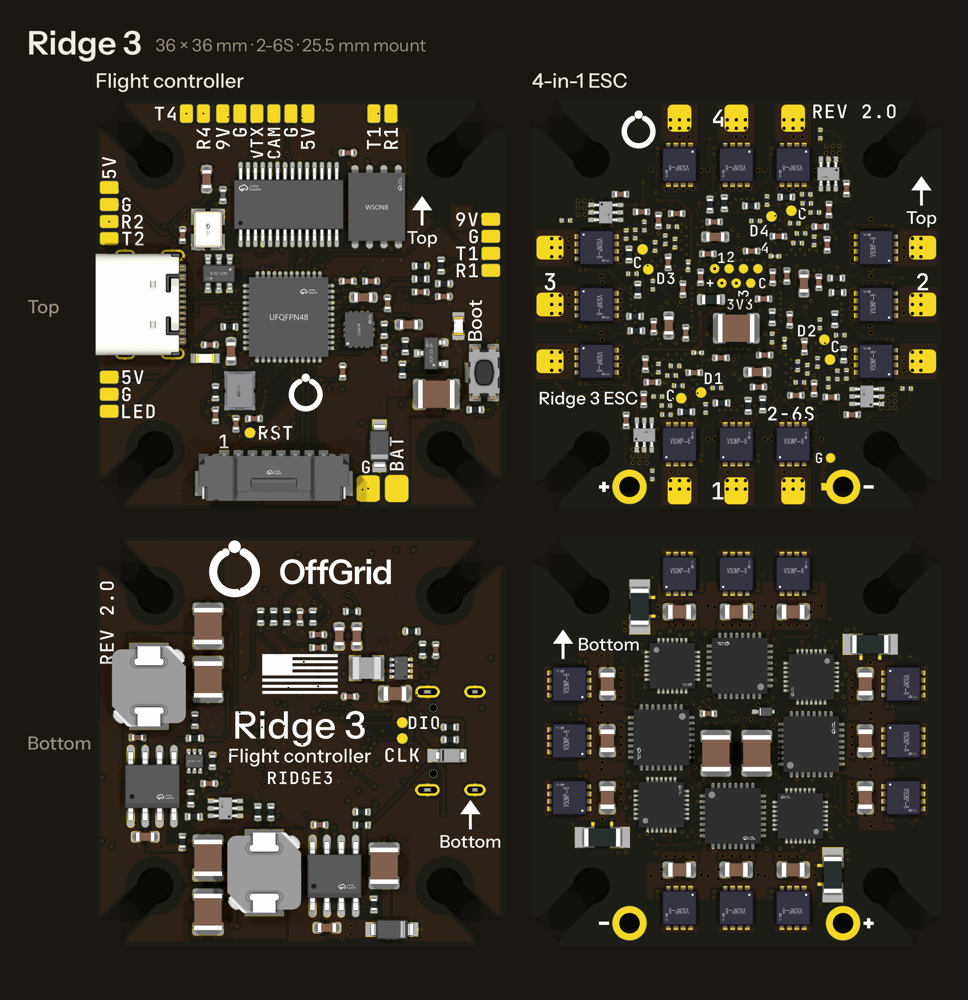

# Ridge 3: flight controller + 4-in-1 ESC for 3-inch quads, 2-6S

Two 36 × 36 mm boards on the 25.5 mm hole pattern: a flight controller with
HD and analog video, and a 4-in-1 ESC with current sensing on every motor.
They connect with the standard 8-pin FPV stack lead, so either board also
works with another maker's FC or ESC. When one breaks, you replace that
board, not the whole stack.

Ridge 3 is the first of a line named by prop size: **Ridge 3**, **Ridge 7**,
**Ridge 12**. Only Ridge 3 is designed so far.

**Status: designed, not yet built.** Both boards pass KiCad DRC with zero
errors, zero warnings and zero unconnected items against JLCPCB's rules.
The copper matches `src/circuit.py` pad for pad, and
[`VERIFICATION.md`](VERIFICATION.md) checks the design against sources other
than itself (206 checks, all passing). No board has been made or
measured. Order the minimum quantity, build one stack, and go through the
[bring-up](#bring-up) steps before building more.

**Revision 1.0** for both boards: printed `REV 1.0` by a corner of each, and
in each board file's title block, which the Gerbers carry. Each board keeps
its own number (`REVISION` in `src/fc_layout.py` and `src/esc_layout.py`), so
a change to the ESC alone moves only the ESC's.



---

## What it does

| | Flight controller (`fc/`) | 4-in-1 ESC (`esc/`) |
|---|---|---|
| Battery | 2-6S (up to 25.2 V). Every part on the battery runs at 60 % or less of its rating | 2-6S. The 40 V FETs run at 63 % on 6S (see [Headroom](#headroom-and-what-the-stack-cannot-do)) |
| Brain | STM32G473 (170 MHz). Betaflight target `RIDGE3` | 4 × STM32G071. AM32 target `RIDGE3_G071` |
| Sensors | TDK ICM-45686 gyro (a Bosch BMI270 fits the same pads), battery voltage, current from the ESC | Current per motor (0.5 mΩ Kelvin shunt + TI INA186), battery voltage, MCU temperature |
| Video | **HD:** 6-pin JST-SH port for DJI O3/O4, Walksnail and HDZero (MSP DisplayPort on UART1, SBUS jumper). **Analog:** AT7456E OSD with camera and VTX pads | – |
| Power out | 5 V 2 A (TI LMR38020F, 80 V). **9 V 2 A for the VTX** (TI LM76003, 60 V), which Betaflight can switch off. 3.3 V | – |
| Power stage | – | 24 × Toshiba TPN2R304PL (40 V, 2.3 mΩ), TI DRV8300 gate drivers at 11.3 V |
| Protection | TVS on the battery. The 9 V rail stays off below 6 V | Capacitors across the battery pads (the FC's TVS guards the same battery line). Current limit and temperature limit per motor (AM32), stuck-rotor cut-out |
| Connectors | USB-C, BOOT button, 8-pin stack lead, 6-pin HD lead, solder pads | Through-hole battery pads, motor pads, 8-pin stack lead |
| Blackbox | 16 MB Winbond flash | – |
| Layers | 6 | 6 |
| Mounting | 25.5 mm, M2 soft-mount grommets or M3 | same |

**Mounting holes.** Each corner hole (3.2 mm) has a 2.5 mm slot cut out to
the corner. A standard M3-to-M2 rubber grommet slides in from the corner and
snaps into the hole, rather than being forced through a closed hole. An M3
screw also fits for a hard mount. The outline has no sharp point anywhere:
where each slot opens through the edge, the point is rounded by a tight
0.3 mm arc sweeping into a 2 mm one along the slot (so it takes under 1 mm
of the straight edge, which the production panel's break-off tabs need),
and where the slot meets the hole by a 0.3 mm round, which keeps the lip
that holds the grommet.

**Stack lead:** JST-SH 1.0 mm, 8 pins, pin 1 to pin 1, the FPV standard:
`1 VBAT, 2 GND, 3 CUR, 4 TLM, 5 M1, 6 M2, 7 M3, 8 M4`. The ESC's CUR output
is the average of its four channels' sensors: 12.5 mV per amp of battery
current (Betaflight `ibata_scale` 125, which the firmware sets).

**Motor numbering:** Betaflight's Quad X. Motor 1 is rear-right, 2
front-right, 3 rear-left and 4 front-left. On the ESC, each motor's number is
printed beside its three pads. The order of the three wires within a motor
does not matter: set the direction in ESC-configurator.

---

## Headroom, and what the stack cannot do

**Voltage.** The design rule was that no part runs above 60 % of its rating
on a full 6S pack (25.2 V). Every part that touches the battery meets it
except the 24 power FETs:

| Part | Rating | At 25.2 V |
|---|---|---|
| ESC FETs, Toshiba TPN2R304PL | 40 V | **63 %** (53 % on 5S) |
| ESC gate drivers, TI DRV8300 | 100 V | 25 % |
| ESC 3.3 V buck, ADI MAX15062A | 60 V | 42 % |
| ESC gate-drive LDO, TI TPS7A1601 | 60 V | 42 % |
| FC 5 V BEC, TI LMR38020F | 80 V | 32 % |
| FC 9 V BEC, TI LM76003 | 60 V | 42 % |
| Bridge, bulk and input capacitors | 50-100 V | 25-50 % |

The FETs are the chosen compromise ("Balanced: 40 V parts, 2-6S"). The
60 V FETs that would meet the rule have about twice the on-resistance in the
same package, which costs more heat than it buys in margin. Three things
keep the FETs inside 40 V: the low-ESR capacitors on the battery leads
(**always fit them**), the ceramic capacitor under every half-bridge, and
short battery leads. The ESC has no TVS of its own. The FC's SMF33A sits
on the same battery line through the stack lead and clamps slow surges, but
at its full rated surge it clamps at 53 V, above 40 V, so it does not replace
the capacitors.

**Simulated since: see [`STRESS.md`](STRESS.md).** The stress simulations
(`sim/`) find less headroom than the estimates in this section.

- **Heat:** the ESC's copper loses about as much as its FETs. The
  sense-node copper and the 1 oz battery planes are the largest part of it,
  and the dead time adds more.
- **Bursts:** a full-throttle burst at AM32's 20 A takes the FETs beside
  the battery pads to 175 °C in 2-3 s.
- **Voltage:** switching spikes reach the 40 V FETs' rating on a full 6S
  pack.
- **The stack lead:** the FC's full load is more than its 1 A contact
  carries.

What would fix each is listed at the end of that file.

**Current.** Each FET is rated 80 A with its case at 25 °C (200 A pulsed,
2.3 mΩ maximum at 10 V gate drive; the gates get 11.3 V). A 3" motor's
20-30 A bursts stay under 40 % of that rating. What limits current is heat
in a 36 mm board. From the datasheet on-resistance, the two FETs conducting
in each motor dissipate:

| Per motor | 5 A | 10 A | 15 A | 20 A |
|---|---|---|---|---|
| Conduction loss (25 °C / hot) | 0.11 / 0.17 W | 0.46 / 0.69 W | 1.0 / 1.6 W | 1.8 / 2.8 W |

A board this size sheds about 2.5 W in still air, about 6 W with some
airflow and about 10 W in strong prop wash. These are estimates, not
measurements. So:

- **Bursts of 20 A per motor** (punch-outs) are fine.
- **Sustained 10-15 A per motor with airflow** is the design target. That
  covers every common 3" motor on 4S-6S at cruise and most of the throttle
  range.
- **Sustained 20 A on all four motors** is more heat than the board can shed.
  Firmware settings stop it cooking itself: AM32's per-motor current limit
  (20 A, read from this board's shunts), its temperature limit (110 °C, from
  each MCU's own sensor) and stuck-rotor protection, which cuts a jammed
  motor. See [`firmware/README.md`](firmware/README.md).

The inner copper carries the motor current in the ground (In1) and battery
(In4) planes and the channel returns (In3), and spreads the FETs' heat. It
is 1 oz, not 2 oz: the fab sets one weight for every inner layer, and at
2 oz it etches no finer than 0.15 mm. The inner signal layers need 0.1 mm to
get the gate drive through the FET row. None of this is measured yet:
bring-up step 6 measures it.

**What it cannot do:**

- 7S or 8S. That is Ridge 7's job.
- Serial ESC telemetry: the stack lead's TLM wire is not connected.
  Bidirectional DShot carries RPM, and AM32's extended DShot telemetry
  carries temperature, voltage and current, instead.
- A barometer or a magnetometer. GPS goes on UART4.

---

## Cost, against an $80 AIO

The reference is the GEPRC TAKER G4 AIO this stack replaces, about $80.
Component cost comes from JLC's live catalogue prices on 29 September 2026, before
assembly fees and bare boards:

| | 1 set | 100 sets | 1,000 sets |
|---|---|---|---|
| FC | $38.83 | $25.81 | $24.20 |
| ESC | $45.65 | $31.31 | $29.40 |
| **Stack** | **$84.48** | **$57.12** | **$53.60** |

- **One-off, it costs more than the AIO.** The parts alone pass $80, and
  on top of them come JLC's per-order assembly fees: setup, stencil, and a
  loading fee for each unique extended part (31 on the FC, 19 on the ESC).
  Those fees are what a prototype order pays.
- **In volume, the parts cost about 70 % of the AIO's price.** Bare boards
  and assembly add to that. The 6-layer ESC is the expensive board. Get a
  JLC or PCBWay quote for the panels at the volume you plan: they were not
  priced here.
- **The point is the repair.** A crash that kills a motor channel costs one
  ESC, about $30 in parts at volume, not a whole $80 AIO. The same goes for
  a flight controller. And either board works with another maker's stack.
- **What costs most** (per set at 1,000): the 24 FETs ($10.37), the four
  ESC MCUs ($8.84), the gyro ($8.12), the FC MCU ($5.19) and the flash
  ($2.19).
- **The gyro is a choice.** The TDK ICM-45686 costs about $9 a set more
  than a Bosch BMI270 one-off, and about $7 more in volume. The BMI270 fits
  the same pads and has its own firmware image, so a build can take either
  part with no copper change (see [`firmware/README.md`](firmware/README.md)).

## Sourcing: LCSC/JLCPCB and DigiKey

Every part has an LCSC number (for JLCPCB assembly) and a DigiKey part
number (in `src/parts.py`). The same boards can be built by JLCPCB today and
by a US or allied assembler from a DigiKey kit later, with no copper change.
The chips that matter come from non-Chinese makers: ST (MCUs), TDK
InvenSense (gyro, with Bosch as the second source), TI (supplies, gate
drivers, current amplifiers), Analog Devices (ESC buck), Toshiba (FETs),
Winbond (flash), and Vishay, Murata, TDK, Taiyo Yuden, Stackpole, Yageo,
Lite-On, GCT, JST and Omron (passives and connectors).

The exceptions and thin spots, checked 27 September 2026:

| Part | Issue | What to do |
|---|---|---|
| AT7456E analog OSD | Made in China. It is the only analog OSD chip still in production (the Maxim MAX7456 it copies is discontinued) | Accepted exception. An HD-only variant can leave it off: Betaflight runs without it |
| ICM-45686 (gyro) | DigiKey had none on 29 September 2026; JLC/LCSC had 1,022 | Buy ahead, or fit the Bosch BMI270 (same pads; flash the `RIDGE3_BMI` image) |
| STM32G071 (ESC MCUs) | DigiKey has almost none (0-19 of the GBU6; 79 of the 64 KB G8U6, which has the same pads and firmware) | Buy ahead. JLC/LCSC had 999 GBU6 (249 ESCs) |
| TPN2R304PL (ESC FETs) | JLC/LCSC stock covers 107 ESCs (DigiKey: 50,515) | For bigger runs, consign DigiKey reels to the assembler, or fit the Diodes Inc. DMTH43M8LFGQ (same pads, 3.0 mΩ; check placement on the first boards) |
| Resistors | JLC's are UNI-ROYAL (operations in China) | Yageo equivalents are listed as `dk_mpn` in `parts.py` |

## Selling in the US and allied countries (not legal advice)

- **FCC Covered List (22 Dec 2025).** New foreign-produced UAS critical
  components, flight controllers and motors among them, cannot get FCC
  equipment authorization, whichever country made them (allies included).
  The exemptions are the Blue UAS list and US-made "domestic end products"
  (US-assembled, over 65 % US component value), both extended to 1 Jan 2028,
  plus DoW Conditional Approvals for producers with an onshoring plan.
  Whether a radio-less FC/ESC needs FCC authorization at all is arguable
  (47 CFR 15.103(a)). Get a TCB or FCC counsel opinion before selling in the
  US.
- **NDAA §848 (DoD) and the American Security Drone Act (federal
  agencies).** These bind government buyers. §848 bars flight controllers
  (not ESCs) made in China, Russia, Iran or North Korea; ASDA looks at who
  manufactured or assembled the product. A JLCPCB-assembled FC fails both.
  The same design assembled in the US or an allied country by a non-PRC
  firm passes, which is what the DigiKey BOM is for.
- **From 1 Jan 2027** (10 U.S.C. 4873), DoD may not buy PCBs made in those
  four countries, so a compliant build also needs a non-PRC bare-board fab.
  The Gerbers suit any 4- and 6-layer ENIG fab; the ESC's filled
  vias-in-pad are a standard option.
- **Claims.** Say what is true and documented ("assembled in USA; key
  chips from US, EU and Japanese makers"). Do not claim "NDAA compliant" or
  "Blue UAS" until it is.

## The name

"Ridge" names the line by prop size: Ridge 3, Ridge 7, Ridge 12. A web
search found no FPV product called Ridge. Still to do: a trademark search
(USPTO, EUIPO, UKIPO, CIPO) and attorney clearance, and a check of the house
mark. "OFFGRID" is registered in class 9 by another company (Faraday bags,
Reg. 6076046).

---

## Ordering

Everything to upload is in `fc/production/` and `esc/production/`. You do
not need KiCad or Python.

### Bare boards (JLCPCB or PCBWay)

Upload `ridge3-fc-gerbers.zip` and `ridge3-esc-gerbers.zip` as two separate
orders:

| Setting | FC | ESC |
|---|---|---|
| Layers | **6** | **6** |
| Dimensions | 36 × 36 mm (read from the outline) | same |
| Thickness | 1.6 mm | 1.6 mm |
| Material | FR-4, TG155 or better | same |
| Solder mask | **Black** (JLCPCB) / **Matte black** (PCBWay): the brand's Pitch | same |
| Silkscreen | **White**: the brand's Bone | same |
| Surface finish | **ENIG**: the QFN and LGA parts need a flat finish | same |
| Outer copper | 1 oz | 1 oz |
| Inner copper | 0.5 oz | **1 oz**. Not 2 oz: JLCPCB's finest on 2 oz is 0.15 / 0.15 mm, and the inner signal layers use 0.1 mm |
| Via covering | **Epoxy filled and capped (POFV)**: vias sit in pads | **Epoxy filled and capped (POFV)**: vias sit in pads, down to 0.25 mm vias inside the chips' 0.25 mm pins. JLCPCB makes POFV the free default on 6-layer boards; at PCBWay it is a paid option |
| Min track / spacing | 0.1 / 0.1 mm | 0.1 / 0.1 mm |
| Min via | 0.35 mm / 0.15 mm drill (JLCPCB's multilayer minimum drill) | 0.25 mm / 0.15 mm drill (inside the chips' pins); 0.35 / 0.15 elsewhere. JLCPCB's multilayer minimum, at its small-via surcharge |
| Stackup | The fab's standard 1.6 mm 6-layer build | Any standard 1.6 mm 6-layer build with 1 oz inner layers. No impedance control needed |
| Order number | "Specify location" or "Remove": no spot is kept free for it | same |

The outline includes the four corner slots. They are routed with the
outline, so no special order option is needed: the slot is 2.5 mm wide,
above every fab's minimum router slot.

### Assembly (JLCPCB PCBA)

| | FC | ESC |
|---|---|---|
| Sides | **Both sides** | **Both sides** |
| BOM | `ridge3-fc-bom-jlcpcb.csv` | `ridge3-esc-bom-jlcpcb.csv` |
| CPL (pick and place) | `ridge3-fc-cpl-jlcpcb.csv` | `ridge3-esc-cpl-jlcpcb.csv` |

Every part has an LCSC number, and all were in stock at JLCPCB on 27 September 2026.

- **Placement preview:** in JLCPCB's placement preview, check pin 1 of the
  QFN parts and the orientation of the SH connectors before paying.
  Rotations follow each part's JLCPCB library footprint, so they should need
  no changes.
- **PCBWay:** use `*-bom-pcbway.csv`. It lists the manufacturer part
  numbers and the LCSC numbers, with the same CPL.
- **Not assembled:** the battery lead, the bulk capacitors, motor wires, the
  receiver, the VTX and the stack cable. These are hand-soldered or plugged
  in.

### Also needed (not on the boards)

- **Bulk capacitors for the ESC:** two 100 µF 50 V low-ESR electrolytics,
  Rubycon 50ZLH100MEFC8X11.5 (LCSC C109393, DigiKey 1189-2327-ND). Solder
  them across BAT+ and BAT- together with the battery lead, observing their
  polarity. **Do not fly without them:** they absorb the voltage spikes that
  otherwise kill the 40 V FETs on 6S.
- **Battery lead:** XT30 or XT60 pigtail, 16-18 AWG.
- **Stack cable:** 8-pin JST-SH, pin 1 to pin 1. Most 4-in-1 ESCs come with
  one. Check it with a multimeter: VBAT (pin 1) must reach pin 1 at both ends.
- **Grommets:** four M3-to-M2 soft-mount grommets per board (the usual FPV
  stack grommets).
- **ST-Link V2** (or a clone) to flash the ESC bootloaders once.

### Ordering in volume

**Panels.** JLCPCB's Standard assembly is the only JLC service that places
both sides and takes large quantities. It needs a board or panel of at least
70 × 70 mm. `make.py` therefore also writes a **3 × 2 panel** of each board
to `production/panel/`: Gerbers, BOM and CPL, ready to upload in place of
the single-board files. The panel is 112 × 88 mm with six boards, 5 mm
rails, mouse-bite tabs, three fiducials per side and four 2 mm tooling
holes. Every board keeps a strip at each corner of every edge free of parts
and copper, so the tabs never sit on the grommet slots or next to a part.
The rail reads `JLCJLCJLCJLC`, so JLC prints its order number there rather
than on a board. After depanelling, sand the tab stubs flush (up to
0.25 mm). `make.py` checks every copy on the panel against the single board:
Gerbers (to 10 nm, and filled regions by shape), BOM and CPL. It also checks
that the panel's DRC result equals six copies of the board's own.

**Programming** is the one per-unit labour step. Each FC flashes over USB
(hold BOOT, plug in). Each ESC needs four short SWD sessions on its test
pads. At volume, use a pogo-pin fixture on those pads, or the assembler's
pre-programming service.

---

## Assembly

1. **Receiver on the FC:** the left edge's front pads, `5V`, `G`, `R2` to
   the receiver's TX, `T2` to the receiver's RX. CRSF on UART2 is the
   default.
2. **Video:**
   - **HD** (DJI O3/O4, Walksnail, HDZero): plug the air unit's 6-pin lead
     into the FC's HD port. If the air unit carries the receiver's SBUS
     (DJI), close the `SBUS` jumper.
   - **Analog:** camera on `CAM`, `G`, `5V`; VTX on `VTX`, `G` and `9V`,
     along the front edge.
3. **Flash the ESCs** while the ESC board is bare: no battery lead, no
   capacitors, not stacked. See [`firmware/README.md`](firmware/README.md).
   The SWD pads are on the ESC's top. `3V3` and `G` are at the two ends of
   the rear edge. Each MCU's `Cn` (clock) and `Dn` (data) pads are over that
   MCU, on the board's middle side of motor n's FETs. The ST-Link's 3.3 V
   powers all four MCUs.
4. **Battery lead and capacitors** onto the ESC's rear pads: `+` left,
   `-` right, as printed on both sides. The two capacitors go across the
   same pads.
5. **Motor wires:** each motor's three wires to the three pads beside its
   number.
6. **Stack:** ESC at the bottom, FC on top, both with the **front arrow
   forward** and the side marked **Top** facing up. Slide the grommets into
   the corner slots, then fit the stack cable. (The FC's gyro alignment
   assumes its top faces up; Betaflight's board alignment can change that.)

## Bring-up

Do these in order. Each step catches a fault before it can damage the next.

1. **No power:**
   - Measure BAT+ to BAT- on the ESC. It must not read as a short: the
     meter should climb past a few kΩ as the capacitors charge.
   - Measure the FC's `5V`, `9V` and `3V3` pads to `G` the same way.
2. **FC on USB only:**
   - The red power LED lights.
   - Flash Betaflight: hold **BOOT**, plug in USB, and follow
     [`firmware/README.md`](firmware/README.md). There are two images, one
     per gyro chip: flash the one for the chip on the board.
   - Paste `firmware/betaflight/cli-setup.txt` into the CLI.
3. **Orientation, before anything spins.** Phase 1 lost three crashes to a
   wrong board alignment, so check it on the bench, not in the air. In the
   Setup tab:
   - Tilt the nose down: the model goes nose down.
   - Tilt the right side down: the model rolls right.
   - Yaw right: the model yaws right.
   Then calibrate the accelerometer on a level surface.
4. **ESC on a current-limited supply:** 15 V with a 0.3 A limit, or a
   smoke stopper on the battery.
   - It should idle at a few tens of mA.
   - Check 3.3 V at the `3V3` test pad.
5. **Stack plus battery, props off:**
   - ESC-configurator, through Betaflight passthrough, must see four AM32
     ESCs. Set the motor KV and pole count, the current limit (20 A) and
     the temperature limit (110 °C).
   - In Betaflight's Motors tab, spin each motor slowly. Confirm the order
     is 1 rear-right, 2 front-right, 3 rear-left, 4 front-left, and fix the
     directions in ESC-configurator.
   - Check the RPM and current readouts. Bidirectional DShot working means
     the motor signal path is sound. The current reading should rise with
     throttle.
6. **Heat, props on, before the first real flight.** Tape a thermocouple
   to the hottest FET (the channel farthest from the battery pads). Hold
   the quad down and run full throttle for 10 s, then 30 s. Stop at 100 °C.
   Until this is measured, this is the ESC's only current rating: see
   [Headroom](#headroom-and-what-the-stack-cannot-do).
7. **First flight:** hover on a leash or in a net first.

---

## The look

Both boards follow the OffGrid brand hand-off (v3.2). Dark is the brand's
default expression, so the boards are **Pitch** (black solder mask) with
**Bone** type (white silkscreen) and ENIG gold pads.

- The FC's bottom carries the horizontal lockup (the mark and "OffGrid")
  centred on the front edge, with no tagline, and under it, on the centre
  line, the flag of the United States, the product name and the firmware
  to flash. Its top carries the mark on its own.
- In the lockup the word sits on one line with the mark, its capitals
  centred on the ring. This is the one change from the hand-off file,
  whose baseline leaves the word 25 units (of its 200) above the ring's
  centre; it was made at the owner's direction.
- The flag is not from the brand files. It is drawn in the proportions of
  Executive Order 10834 (hoist 1, fly 1.9, 13 stripes), 4 mm high, in one
  colour: the red stripes and the union are ink, the white stripes are
  the board. The 50 stars are left out: at this size each would be about
  0.25 mm across, below what silkscreen prints, so the union is solid.
- Every side carries the same front arrow (2.6 mm long, 1.8 mm across the
  head: one definition in `src/brand.py`) with the side's name, **Top** or
  **Bottom**, beside it. Where it sits and which side of the arrow the word
  takes depends on each side's free room.
- The ESC is full of parts on both sides. Its mark sits on top in the
  roomiest free spot, at the front edge. The top also carries the name, each
  motor's number, the pack range, the SWD pad names and the stack
  connector's pin 1. Neither side has room for the firmware code at the
  smallest size the fab prints cleanly (1 mm), so it is not printed: the
  build to flash is `RIDGE3_G071` ([`firmware/README.md`](firmware/README.md)).
- Every mark is at or over the brand's minimum size (16 px for the mark,
  24 px for the lockup, at 1/96 in per px) with its clear space kept, and no
  ink goes under the grommets.
- Pad names, part codes and numerals are JetBrains Mono. Words ("Boot",
  "Flight controller") are Instrument Sans. Both follow the brand's `tokens.json`.
- Everything is drawn as filled outlines from the fonts in `fonts/` (SIL
  OFL), not KiCad's stroke font. The Gerbers carry the exact letterforms,
  and nobody needs the fonts installed.
- Silkscreen prints one colour, and the brand's rule is one accent or none,
  so there is no Ember.

---

## Files

```
ridge-3/
  README.md               this file
  images/                 both sides of both boards on one sheet
  VERIFICATION.md         every design check that can be made without
                          hardware, with its result (src/verify.py)
  STRESS.md               the stack simulated flat out, hot, on 6S: copper,
                          switching, battery line, stack lead, heat (sim/)
  fc/                     flight controller
    ridge3-fc.kicad_pcb / .kicad_pro / .kicad_dru   open in KiCad 10
    production/           Gerbers zip, BOM + CPL (JLCPCB), BOM (PCBWay),
                          netlist, assembly drawing (PDF)
      panel/              the same for a 3 x 2 panel, for volume assembly
    images/               renders
  esc/                    4-in-1 ESC, same layout
  mechanical/             STEP models of both boards (zipped), for frame CAD
  firmware/               Betaflight images (one per gyro chip), AM32
                          bootloader and firmware, the AM32 target patch,
                          flashing script, CLI setup
  docs/research/          the research behind the part choices: ESC power
                          stage, FC video, sourcing and market, final parts
  aio.pretty/ aio.3dshapes/   footprints and 3D models (from JLCPCB/EasyEDA's
                          own library entries for the exact LCSC parts; the
                          JST-SH and USB-C connectors use KiCad's own models)
  fonts/                  Instrument Sans and JetBrains Mono (SIL OFL)
  src/                    the design, as Python (see below)
  sim/                    the stress simulations behind STRESS.md
  video/                  exploded-view videos, made from the board files
  requirements.txt
```

## How it is made (and how to change it)

The design is the Python in `src/`. Nothing is drawn by hand, and nothing
is patched after the fact: every board comes out of the same code path.

| File | What it holds |
|---|---|
| `circuit.py` | The schematic: every part and every connection, pin by pin, with the reasons. |
| `parts.py` | Every orderable part, with its LCSC and DigiKey numbers, MPN and footprint. |
| `footprints.py` | Builds `aio.pretty` from the JLCPCB/EasyEDA library entries, plus the pads, test points and slotted mounting holes. |
| `fc_layout.py`, `esc_layout.py` | Placement, power copper, planes and silkscreen. The ESC is one motor channel written once and stamped onto four edges: each gate resistor sits beside its FET's gate pin, each bootstrap capacitor over its driver's pins. |
| `legalize.py` | Packs the parts round their intended spots: the parts that must sit at a pin first, each supply's parts with their chip, nothing in a reserved via corridor or tab strip. |
| `route.py`, `fanout.py`, `finish.py` | Plane fan-out and escape vias, then Freerouting for the signal routing, then an in-house maze router with rip-up for the last connections. |
| `cleanup.py`, `pofv.py` | ESC clean-up after routing: unused escape vias and stubs come out one at a time, each removal kept only if KiCad's DRC agrees; vias move off the POFV hole spacing if needed. |
| `pipeline.py` | The order the above run in for `--reroute`. |
| `artwork.py`, `brand.py` | Silkscreen placement (labels go only where they touch no pad, hole, part body, grommet or other label) and the OffGrid mark, lockup and type as outlines. |
| `fab.py` | Gerbers, drills, BOM, CPL, netlist, assembly PDF, renders, STEP. |
| `panel.py` | The 3 × 2 production panel (KiKit), checked copy by copy against the single board. |
| `make.py` | Runs it all with gates. |
| `verify.py` | Writes `VERIFICATION.md`. |

`python3 make.py` rebuilds every output from the committed `.kicad_pcb`
files. It fails unless each board has zero DRC errors, zero warnings and
zero unconnected items, the copper matches `circuit.py` pad for pad, and
every assembled part is in the BOM and the CPL. `python3 make.py --reroute`
places and routes both boards from scratch first, with a fixed seed per
board, so the same inputs give the same boards.

The tools: KiCad 10 (`pcbnew` Python module and `kicad-cli`), Freerouting
1.9 (Java, headless via `xvfb-run`), KiKit 1.8 for the panel, and Python
3.12 with the packages in `requirements.txt`.

### Exploded-view videos

`python3 video/make_video.py fc` (or `esc`) makes a 16:9 video of a board
taking itself apart, straight from its `.kicad_pcb`. The board stands on
its edge and opens sideways into its layers: the parts on each side, each
solder mask with its silkscreen printed on it, and every copper layer on its
FR-4. The camera then stops on the top side's parts, on all the copper at
once, and on the bottom side's parts (seen from the side they face), naming
each, and pulls back to the whole with a label on each. Last, the board
closes and lies down under the title.

- **Labels:** they come from the board file itself: what the copper layers
  carry (a layer mostly covered by one net and nearly free of tracks is that
  net's plane), which sides have silkscreen, and the part count on each side.
- **Tour:** `"tour"` in a board's settings picks the stops (by default
  `components top`, `copper`, `components bottom`; `mask top` and
  `mask bottom` are the other units).
- **Settings:** each board's own settings are a few lines in `video/fc.json`
  and `video/esc.json`: the title and a few words on the main parts. A
  changed board needs only the command again, and a new board needs its own
  small JSON.
- **Draft or final:** without options it makes a 720p, 30 fps draft in
  `video/out/`. `--final` renders 4K at 60 fps into the board's `images/`,
  and `--stills 0,270` renders a few labelled frames to check the look.
- **Setup:** the first run sets up `video/.venv` (Python 3.11 with Blender as
  a module).
- **Rendering:** it uses Cycles, on a GPU when Blender finds one (CUDA,
  OptiX, HIP, Metal, oneAPI), otherwise on the CPU. A 4K frame takes 2-4.5
  minutes on a 4-core CPU; a stopped render resumes.

### Stress simulations

`sim/.venv/bin/python sim/stress.py` writes `STRESS.md` and its figures in
`images/stress/`: the FC on the ESC, a full 6S pack, hot air, full current.
It reads both `.kicad_pcb` files, so it follows the boards as they change.

| File | What it does |
|---|---|
| `copper.py` | Each board's copper as a 0.05 mm grid per layer: which net owns each cell, every via and plated hole, the pads of each part. |
| `dcflow.py` | DC current flow in one net's copper: voltage, current density, loss, current in each via barrel. Checked against a strip and a ring. |
| `copperloss.py` | Where the motor current heats the ESC's copper, per amp squared, over AM32's six commutation steps. |
| `spice.py` | ngspice: one half-bridge switching (Toshiba's FET model, the DRV8300 as its datasheet drive), the battery line, and the FET model's checks against its datasheet. |
| `thermal.py`, `stack.py` | Both boards as thermal grids, stacked with the air gap between them; each part that heats or has a temperature limit gets a node. |
| `losses.py` | Heat per part for an operating point: FETs, switching, dead time, shunts, drivers, regulators, the FC's supplies. |
| `data.py` | Every datasheet figure used, with its source, and each assumption, marked as one. |
| `stress.py` | The scenarios and the report. |

- **Setup:** ngspice (`apt install ngspice`), and a venv that sees KiCad's
  `pcbnew`: `python3.12 -m venv --system-site-packages sim/.venv`, then
  `sim/.venv/bin/pip install "pyamg<5.1"` (5.0 works with the SciPy 1.11
  that Ubuntu ships; newer pyamg needs SciPy 1.12).
- **The FET model:** Toshiba gives out its TPN2R304PL SPICE model behind a
  free model-use agreement, for simulation, not for passing on, so it is
  not in this repository. Download the PSpice zip from the part's page
  ("Design & Development", "SPICE model") and put
  `TPN2R304PL_G0_00_PSpice_rev1.lib` in `sim/out/spice/`, or point
  `TPN2R304PL_LIB` at it.
- **Time:** about half an hour on a 4-core machine; the copper maps are
  cached in `sim/out/` per board file.
