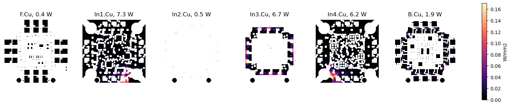
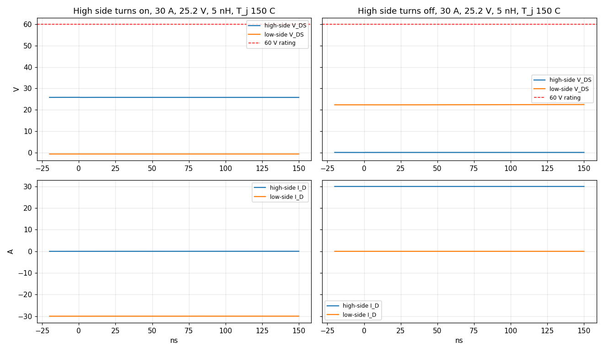
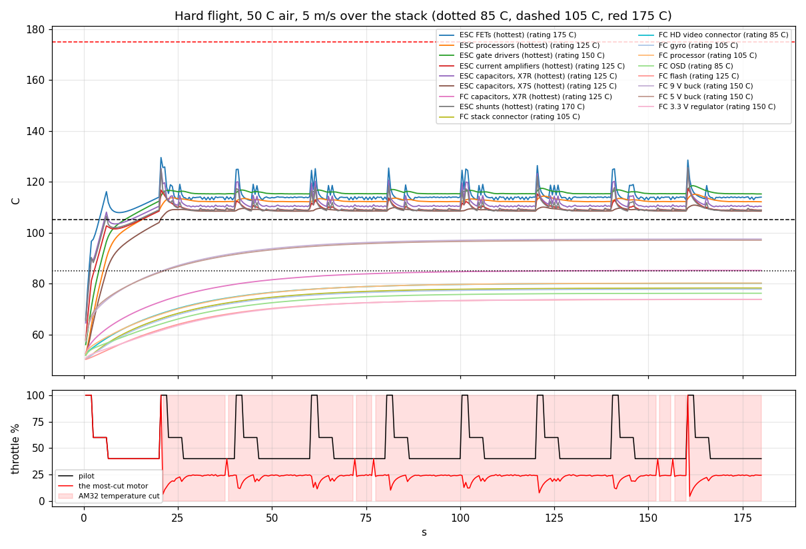
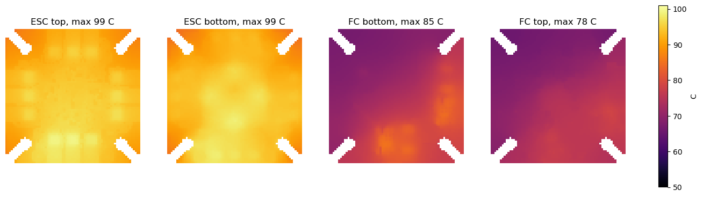

# Ridge 3 stack: stress simulations

Generated by `sim/stress.py` on 2026-10-03.  The FC on the ESC, a full 6S pack (25.2 V), hot air (50 C is the design's hot day), full current.  Rev 2, the design in this repository, is reported in full; rev 1 (commit c2572f6) is run through the same simulations for the comparison below.

**What this is not:** a measurement.  These are simulations of the design files, with the makers' datasheet figures (`sim/data.py`, each with its source) and a few stated assumptions.  They say where the design runs out of margin and roughly by how much.  Bring-up on the bench is still the test.

## Verdict (rev 2)

| Area | Check | Result | Simulated | Limit |
|---|---|---|---|---|
| Heat | Hover (27 % throttle) held indefinitely with every part in its rating, 60 C air, 5 m/s | **FAIL** | up to 0 % throttle | 27 % |
| Heat | Full-throttle burst from hover (AM32 at 20 A per motor), 25 C air, 5 m/s | **FAIL** | a FET reaches 175 C after 5.2 s; AM32's cut after 2.2 s | 175 C |
| Heat | Full-throttle burst from hover (AM32 at 20 A per motor), 50 C air, 5 m/s | **FAIL** | a FET reaches 175 C after 3.0 s; AM32's cut after 0.2 s | 175 C |
| Heat | Hard 3-minute flight at 50 C: AM32 cuts a motor's power for heat | **FAIL** | first at 21 s, 87 % of the flight | never |
| Heat | Hard 3-minute flight at 50 C: first part past its rating | **FAIL** | ESC C17 (X7R capacitor (Murata GRM21BZ71H475KE15L)) at 20 s | 125 C |
| Heat | On the ground, video on (9 V at 1.5 A, 5 V at 1 A), 25 C still air | **FAIL** | 2 parts past their rating, video on 51 % of the time (thermostat) | - |
| Heat | On the ground, video on (9 V at 1.5 A, 5 V at 1 A), 50 C still air | **FAIL** | 2 parts past their rating, video on 0 % of the time (thermostat) | - |
| Heat | On the ground, video on (9 V at 1.5 A, 5 V at 1 A), 60 C still air | **FAIL** | 5 parts past their rating, video on 0 % of the time (thermostat) | - |
| Voltage | SHx below ground at high-side turn-off, 5 nH loop (3-8 nH bracket) | **MARGINAL** | -6.2 V (-8.5 V in the bracket) | -7 V for 200 ns (DRV8320H; -5 V continuous) |
| Voltage | High-side FET at turn-off, 30 A, 5 nH loop | PASS | 32.3 V | 60 V rating |
| Voltage | Low-side FET after the high side turns on (body-diode recovery) | PASS | 26.8 V (worst case) | 60 V rating |
| Voltage | High-side FET at turn-off, 20 A, while a throttle chop holds the bus at 31-35 V | PASS | 41.0 V | 60 V rating |
| Voltage | Off FET's gate kicked up by the other FET turning on (hot) | PASS | 0.25 V | Vth min 1.1 V at 25 C, about 0.4 V at 150 C |
| Voltage | Plugging in a full 6S pack, leads up to 300 nH | PASS | 39.7 V | 60 V FETs |
| Voltage | Ripple self-heating of the board's bus capacitors, 4 x 30 A | PASS | 15.6 A rms, 4.1 C each | 20 C (Murata) |
| Stack lead | FC at full load, lead current on an empty 6S pack | PASS | 0.57 A | 1.5 A per contact (Molex Micro-Lock Plus 505567) |
| Stack lead | Ground-loop current in the lead's GND contact, video pads also wired, 20 A per motor | PASS | 0 A (the loop does not enclose the planes) | 1.5 A |
| Heat | Hover (27 % throttle) held indefinitely with every part in its rating, 25 C air, 5 m/s | PASS | up to 44 % throttle | 27 % |
| Heat | Hover held indefinitely with the FETs under 150 C, 25 C air, 5 m/s | PASS | up to 48 % throttle | 27 % |
| Heat | Hover (27 % throttle) held indefinitely with every part in its rating, 50 C air, 5 m/s | PASS | up to 34 % throttle | 27 % |
| Heat | Hover held indefinitely with the FETs under 150 C, 50 C air, 5 m/s | PASS | up to 42 % throttle | 27 % |
| Heat | Hover held indefinitely with the FETs under 150 C, 60 C air, 5 m/s | PASS | up to 40 % throttle | 27 % |
| Heat | Hard 3-minute flight at 50 C: hottest FET | PASS | 130 C | 175 C (150 C design) |
| Heat | Hard 3-minute flight at 50 C: ESC processors | PASS | 115 C | 125 C junction (Artery AT32F421G8U7) |

## Rev 2 against rev 1

The same simulations on both designs: rev 1's boards and circuit from git (commit c2572f6), rev 2 from the working tree.

| | Rev 1 | Rev 2 | |
|---|---|---|---|
| Throttle held indefinitely with every part in its rating, 50 C air, 5 m/s | 5 % | 34 % |  |
| Throttle held indefinitely with the FETs under 150 C, 50 C air, 5 m/s | 40 % | 42 % |  |
| Throttle held indefinitely with every part in its rating, 60 C air, 5 m/s | 0 % | 0 % |  |
| Throttle held indefinitely with the FETs under 150 C, 60 C air, 5 m/s | 36 % | 40 % |  |
| Throttle held indefinitely with every part in its rating, 50 C air, 2 m/s | 0 % | 0 % |  |
| Throttle held indefinitely with the FETs under 150 C, 50 C air, 2 m/s | 30 % | 29 % |  |
| Full-throttle burst from hover, 50 C, 5 m/s: a FET reaches 175 C after | 1.8 s | 3.0 s |  |
| Hard 3-minute flight, 50 C: hottest FET | 153 C | 130 C |  |
| Hard 3-minute flight, 50 C: hottest ESC processor | 117 C | 115 C |  |
| Hard 3-minute flight, 50 C: share of the flight AM32 cut a motor for heat | 96 % | 87 % |  |
| Hard flight, 50 C: FC processor | 82 C | 80 C |  |
| Hard flight, 50 C: FC gyro | 81 C | 78 C |  |
| Hard flight, 50 C: FC 9 V buck | 104 C | 97 C |  |
| Hard flight, 50 C: FC 5 V buck | 106 C | 97 C |  |
| Hard flight, 50 C: FC stack connector | 84 C | 78 C |  |
| Hard flight, 50 C: first part past its rating | ESC C16 at 2 s | ESC C17 at 20 s |  |
| On the ground, 50 C still air, HD video (9 V 1.5 A, 5 V 1 A): parts past their rating | 29 | 2 (video on 0 % of the time) |  |
| Same: FC processor | 126 C | 103 C |  |
| ESC heat while hovering, 50 C | 7.2 W | 8.7 W |  |
| Sense-node copper, low-side FET to shunt (mean) | 5.39 mOhm | 2.05 mOhm |  |
| Battery planes, VBAT + GND | 2.25 mOhm | 1.14 mOhm |  |
| FET voltage rating | 40 V | 60 V |  |
| High-side FET at turn-off, 30 A, 5 nH | 40.2 V | 32.3 V |  |
| Low-side FET after the high side turns on (worst case) | 40.3 V | 26.8 V |  |
| Plugging in a full 6S pack, leads up to 300 nH | 26.2 V | 39.7 V |  |
| Stack lead current, FC at full load, empty 6S | 1.55 A | 0.57 A |  |
| Stack lead contact rating | 1.0 A, 85 C | 1.5 A, 105 C |  |
| Ground-loop current in the lead, FC battery pads also wired, 20 A per motor | 1.6 A | 0.0 A |  |
| Largest ESC processor ground offset against the lead's ground, 30 A per motor | 17 mV | 62 mV |  |

Verdicts: rev 1 6 pass, 4 marginal, 16 fail; rev 2 15 pass, 1 marginal, 8 fail.

## 1. The FET model against its datasheet

Infineon publishes a SPICE model of the ISZ023N06LM6 (its OptiMOS 6 library, body diode included).  Before trusting its switching, each figure the datasheet gives was simulated in the datasheet's own test circuit:

| Quantity | Datasheet (typ) | Model | Test |
|---|---|---|---|
| RDS(on) at 25 C | 2.0 mOhm (max 2.3) | 2.03 mOhm | VGS 10 V, 20 A |
| RDS(on) at 125 C | - | 3.17 mOhm (x1.56) | same |
| Ciss | 3200 pF | 3209 pF | VDS 30 V, 1 MHz |
| Crss | 21 pF | 21 pF | same |
| Coss | 870 pF | 867 pF | same |
| Qg to 10 V | 46 nC | 46.6 nC | 30 V, 20 A |
| Qgd | 6.0 nC | 4.9 nC | same |
| Reverse recovery (Qrr + Qoss) | 23 + 50 nC, trr 29 ns | as supplied: 95 nC, 56 ns | IF 20 A, 100 A/us, 30 V |

The switching runs below use the maker's model as supplied, its own body diode included.

## 2. The ESC's copper under motor current

Every copper cell of the ESC (0.05 mm grid, all six layers, zones, tracks, pads and via barrels as KiCad fills them) solved for DC current flow, one net at a time, with the FETs, shunts and battery pads putting current in and taking it out where their pads are.  The solver was checked against a copper strip and a ring, whose resistance has a closed form: both agree to within the grid's staircase edges.

Resistance of each current path at 20 C (mOhm).  For comparison, one FET is 2.3 mOhm at most (datasheet, 25 C):

| Channel | Phase copper, high side / low side | Sense node: low-side FET A / B / C to the shunt |
|---|---|---|
| ESC 1 | 0.26 / 0.20 | 2.7 / 2.2 / 1.2 |
| ESC 2 | 0.26 / 0.20 | 2.7 / 2.2 / 1.2 |
| ESC 3 | 0.26 / 0.20 | 2.7 / 2.3 / 1.2 |
| ESC 4 | 0.26 / 0.20 | 2.7 / 2.2 / 1.2 |

The battery planes, shared by the four channels, add 0.70 mOhm (VBAT) and 0.44 mOhm (GND) for the total battery current.

**Where the sense-node current funnels.**  The via carrying the largest share of one low-side FET's current on its way to the shunt: 59 % of FET Q1AL's current goes through one 0.30 mm via at (-6.9, +11.8) mm from the board centre, so at 20 A per motor that via carries 12 A.

Copper loss with all four motors at the same current, copper at 100 C (resistance x1.31 of 20 C):

| Operating point | Copper loss | By layer (W) | For scale: FET conduction, 8 FETs at 1.5 x Rmax |
|---|---|---|---|
| 4 x 10 A, 70 % duty | 2.9 W | F.Cu 0.1, In1.Cu 0.3, In3.Cu 0.4, In4.Cu 0.3, In5.Cu 0.2, In6.Cu 0.6, B.Cu 0.8 | 2.8 W |
| 4 x 20 A, 95 % duty | 14.3 W | F.Cu 0.7, In1.Cu 1.8, In2.Cu 0.2, In3.Cu 2.3, In4.Cu 1.8, In5.Cu 0.9, In6.Cu 3.0, B.Cu 3.5 | 11.0 W |
| 4 x 30 A, 97 % duty | 32.6 W | F.Cu 1.7, In1.Cu 4.1, In2.Cu 0.5, In3.Cu 5.3, In4.Cu 4.2, In5.Cu 2.0, In6.Cu 7.0, B.Cu 7.9 | 24.8 W |

## 3. Switching edges: one half-bridge at full voltage

One phase leg of the ESC switching the motor current, simulated through both edges: the low side turns off, dead time (969 ns: the TI DRV8320H (RTV) turns a gate on 100 ns after it sees the other one discharged, longer than AM32's own 125 ns), the high side turns on and the low side's body diode recovers, then the high side turns off.  Battery 25.2 V (6S full), the TI DRV8320H (RTV)'s gate current set by its IDRIVE pin (30 mA source, 60 mA sink) straight to the gates, the bridge capacitor at its DC-bias value, the pack 25 mOhm behind 120 nH of leads with the ESC's own bus capacitors (3 x Murata GCJ32EC71H106KA01L 10 uF 50 V X7S 1210 on the board).

The commutation loop's inductance (bridge capacitor, high-side FET, phase vias, low-side FET, sense-node copper, back to the capacitor) is estimated from the layout: the high-side FET on top and the low-side FET 2.4 mm along on the bottom, with the bridge capacitors beside them, make a loop about 5 mm long through the 1.6 mm board, 3.3 mm wide: mu0 x 5 x 1.6 / 3.3 = 3 nH, plus the two FET packages and the capacitor's own inductance, about 5 nH.  That is an estimate, not a field solution, so 3 and 8 nH are run too.

| Body diode | Tj C | I A | Loop nH | Peak VDS high side (turn-off) | Peak VDS low side (turn-on) | SHx min V | SHx slew up / down V/ns | Off gate VGS peak V | Recovery A | Eon / Eoff uJ |
|---|---|---|---|---|---|---|---|---|---|---|
| maker's model | 25 | 10 | 3 | 28.6 | 25.0 | -2.9 | 0.1 / 0.2 | 0.30 | 4 | 20.9 / 10.0 |
| maker's model | 25 | 10 | 5 | 30.1 | 25.0 | -3.8 | 0.1 / 0.2 | 0.26 | 4 | 20.5 / 10.3 |
| maker's model | 25 | 10 | 8 | 32.1 | 25.0 | -5.0 | 0.1 / 0.2 | 0.21 | 4 | 19.9 / 10.7 |
| maker's model | 25 | 20 | 3 | 29.2 | 24.9 | -3.8 | 0.1 / 0.2 | 0.15 | 6 | 41.9 / 22.6 |
| maker's model | 25 | 20 | 5 | 31.5 | 24.9 | -5.1 | 0.1 / 0.2 | 0.05 | 6 | 40.5 / 23.6 |
| maker's model | 25 | 20 | 8 | 34.5 | 25.4 | -7.0 | 0.2 / 0.2 | 0.00 | 6 | 38.8 / 25.0 |
| maker's model | 25 | 30 | 3 | 29.5 | 24.7 | -4.5 | 0.1 / 0.0 | 0.00 | 7 | 63.6 / 36.3 |
| maker's model | 25 | 30 | 5 | 32.3 | 24.7 | -6.2 | 0.1 / 0.0 | 0.00 | 7 | 61.0 / 38.3 |
| maker's model | 25 | 30 | 8 | 36.1 | 26.8 | -8.5 | 0.2 / 0.0 | 0.00 | 7 | 57.6 / 41.1 |
| maker's model | 150 | 10 | 3 | 28.2 | 25.0 | -2.5 | 0.1 / 0.2 | 0.25 | 4 | 21.0 / 10.0 |
| maker's model | 150 | 10 | 5 | 29.5 | 25.0 | -3.3 | 0.1 / 0.2 | 0.20 | 4 | 20.6 / 10.3 |
| maker's model | 150 | 10 | 8 | 31.4 | 25.0 | -4.4 | 0.1 / 0.2 | 0.12 | 4 | 20.0 / 10.7 |
| maker's model | 150 | 20 | 3 | 28.6 | 24.8 | -3.4 | 0.1 / 0.2 | 0.08 | 5 | 42.4 / 22.9 |
| maker's model | 150 | 20 | 5 | 30.8 | 24.8 | -4.7 | 0.1 / 0.2 | 0.00 | 5 | 41.1 / 23.8 |
| maker's model | 150 | 20 | 8 | 33.7 | 24.9 | -6.4 | 0.1 / 0.2 | 0.00 | 5 | 39.4 / 25.1 |
| maker's model | 150 | 30 | 3 | 28.6 | 24.6 | -3.9 | 0.1 / 0.0 | 0.00 | 6 | 65.2 / 37.3 |
| maker's model | 150 | 30 | 5 | 31.2 | 24.6 | -5.5 | 0.1 / 0.0 | 0.00 | 6 | 62.7 / 39.2 |
| maker's model | 150 | 30 | 8 | 34.9 | 25.4 | -7.6 | 0.1 / 0.0 | 0.00 | 6 | 59.4 / 41.9 |
| maker's model, bus at 31.3 V (throttle chop) | 150 | 20 | 5 | 37.0 | 30.9 | -4.7 | 0.2 / 0.2 | 0.12 | 6 | 49.6 / 27.2 |
| maker's model, bus at 35.3 V (throttle chop) | 150 | 20 | 5 | 41.0 | 34.9 | -4.7 | 0.2 / 0.3 | 0.19 | 6 | 55.0 / 29.3 |

What brings the peaks down (Tj 150 C, 5 nH, the maker's model):

| Change | I A | High side V | Low side V | SHx min V | Eon / Eoff uJ | Snubber loss per switched leg at 24 kHz |
|---|---|---|---|---|---|---|
| as designed | 10 | 29.5 | 25.0 | -3.3 | 20.6 / 10.3 | - |
| as designed | 30 | 31.2 | 24.6 | -5.5 | 62.7 / 39.2 | - |
| RC snubber 2.2 ohm + 2.2 nF per FET | 10 | 29.0 | 25.0 | -3.0 | 21.4 / 9.6 | 0.07 W |
| RC snubber 2.2 ohm + 2.2 nF per FET | 30 | 31.4 | 24.6 | -5.6 | 63.5 / 38.1 | 0.07 W |
| RC snubber 1 ohm + 4.7 nF per FET | 10 | 28.3 | 25.0 | -2.6 | 22.2 / 8.8 | 0.14 W |
| RC snubber 1 ohm + 4.7 nF per FET | 30 | 31.5 | 24.6 | -5.6 | 64.4 / 36.6 | 0.14 W |
| RC snubber 1 ohm + 10 nF per FET | 10 | 26.9 | 25.1 | -1.7 | 23.9 / 9.0 | 0.30 W |
| RC snubber 1 ohm + 10 nF per FET | 30 | 30.9 | 24.7 | -5.3 | 66.2 / 35.3 | 0.30 W |
| IDRIVE 10 mA (slower edges) | 10 | 26.9 | 24.6 | -1.7 | 61.3 / 30.7 | - |
| IDRIVE 10 mA (slower edges) | 30 | 27.4 | 23.4 | -2.4 | 198.3 / 104.3 | - |
| IDRIVE 60 mA (faster edges) | 10 | 32.5 | 26.0 | -5.1 | 10.5 / 4.9 | - |
| IDRIVE 60 mA (faster edges) | 30 | 38.2 | 30.0 | -9.5 | 29.4 / 21.4 | - |

## 4. The battery line: plugging in, full throttle, a throttle chop

The pack (25.2 V, 25 mOhm) through 120 nH of leads to the ESC's pads, nothing on the leads: the bus capacitance is on the board (3 x Murata GCJ32EC71H106KA01L 10 uF 50 V X7S 1210 on the board), the ESC's bridge capacitors (12 x GRM21BZ71H475KE15L at 1.0 uF each under 25 V bias) and, through the stack lead (50 nH, 110 mOhm), the FC's input: its TVS (SMF33A, breaking down at 38.7 V, the middle of its 36.7-40.6 V range) and ceramics.

| Event | Leads | Peak at the FETs | Peak at the FC | TVS / capacitor current |
|---|---|---|---|---|
| Plug in a full 6S pack, with the board's own capacitors | 100 nH | 34.6 V | 34.6 V | 0.00 A |
| Plug in a full 6S pack, with the board's own capacitors | 200 nH | 38.0 V | 38.0 V | 0.00 A |
| Plug in a full 6S pack, with the board's own capacitors | 300 nH | 39.7 V | 39.7 V | 0.27 A |
| 4 motors x 30 A, PWM in step, with the board's own capacitors | 120 nH | 28.3 V (9.1 V p-p) | 27.3 V | cap 15.6 A rms, bridge caps 13.7 A rms |
| 4 motors x 30 A, PWM staggered, with the board's own capacitors | 120 nH | 23.6 V (2.3 V p-p) | 23.3 V | cap 8.8 A rms, bridge caps 7.8 A rms |
| Throttle chop, 100 A back into a 25 mOhm pack, with the board's own capacitors | 120 nH | 28.0 V | 27.9 V | 0.00 A |
| Throttle chop, 100 A back into a 60 mOhm pack, with the board's own capacitors | 120 nH | 31.4 V | 31.4 V | 0.00 A |
| Throttle chop, 100 A back into a 100 mOhm pack, with the board's own capacitors | 120 nH | 35.4 V | 35.3 V | 0.00 A |

The ripple current is the pulsed battery current each channel draws while its high side is on, less what the bridge capacitors supply; four channels switching in step is the worst case, evenly staggered the best (the four AM32 processors run their PWM independently, so the real case drifts between the two).  A throttle chop turns the motors into generators: at full speed a motor's back-EMF is about 20 V, and the battery current it can push back peaks at E^2 / (4 V R) = 30 A when the duty drops to half of E/V, through its 137 mOhm; with the wiring's resistance, 100 A for all four motors is used.  The pack takes that current, so the rise is set by the pack's resistance, which no maker publishes: a new, warm pack is about 25 mOhm with its leads, a tired or cold one 60-100 mOhm.

## 5. The stack lead, and the FC's supply

The FC takes its own power from the ESC through the 8-wire stack lead (pin 1 VBAT, pin 2 ground): soldered to the ESC's pads, and at the FC a Molex Micro-Lock Plus 505567, rated 1.5 A per contact, 105 C (20 mOhm per contact assumed, 40 mOhm aged).  The lead feeds only the FC's 5 V BEC (and through it the 3.3 V buck); its pin 4 takes that 3.3 V back to the ESC's four MCUs (84 mA).  The 9 V video supply has its own battery pads, wired to the ESC's battery pads, so the video load never passes through the lead.

| FC load | FC input | Through the lead | Lead current, full 6S (25.2 V) | sagging (21.0 V) | empty (19.8 V) | Video pads' wire, empty 6S |
|---|---|---|---|---|---|---|
| both rails at their 2 A rating | 30.8 W | 11.3 W | 0.45 A | 0.54 A | 0.57 A | 0.98 A |
| HD VTX at 1.5 A on 9 V, 1 A on 5 V | 20.0 W | 5.5 W | 0.22 A | 0.26 A | 0.28 A | 0.73 A |
| analog: 0.5 A on 9 V, 0.5 A on 5 V | 7.6 W | 2.8 W | 0.11 A | 0.13 A | 0.14 A | 0.24 A |

**The ground loop.**  The FC's ground reaches the ESC by two paths: the lead's ground wire and the video pads' ground wire.  On the ESC the lead's ground pad is its own net (FC_GND), joined to the ground plane only at the battery pad, where the video wire lands as well, so the motor current's drop across the ESC's planes (48 mV at 20 A per motor, from the battery pad to the farthest shunt) is not in the loop and drives no current round it.  The two VBAT inputs are separate nets on the FC, so there is no battery-side loop.

Ground offsets at 30 A on every motor: each ESC processor's ground against the lead's ground (at the battery pad), which the FC's DShot signals are referenced to: +51, +38, +62, +59 mV.  DShot is 3.3 V logic with about 1 V of noise margin, so this is harmless.  The current-sense amplifiers' grounds sit +54, +39, +68, +65 mV from it.  CUR is the mean of the four outputs, read against the FC's ground at 12.5 mV per amp of battery current, so the mean offset reads as +4.5 A on the 120 A Betaflight shows (4 %): a reading error, not a fault.

The FC's own supply copper at its full load (copper at 100 C).  The FC's inner layers are 0.5 oz (0.0350 mm):

| Net | Where the current goes in and out | Largest drop | Loss | Densest point | Most in one via |
|---|---|---|---|---|---|
| VBAT | J_ESC +0.57 A, U_BUCK5 -0.57 A | 1 mV | 0.00 W | 28 A/mm2 (F.Cu, 0.035 mm copper) | 0.22 A |
| VBAT_VTX | P_BAT +1.04 A, U_BUCK9 -1.04 A | 6 mV | 0.01 W | 68 A/mm2 (F.Cu, 0.035 mm copper) | 0.53 A |
| +9V | L_9V +2.00 A, J_HD -2.00 A | 3 mV | 0.01 W | 57 A/mm2 (F.Cu, 0.035 mm copper) | 1.01 A |
| BUCK9_SW | U_BUCK9 +2.00 A, L_9V -2.00 A | 2 mV | 0.00 W | 69 A/mm2 (B.Cu, 0.035 mm copper) | 0.00 A |
| +5V | L_5V +2.00 A, P_RX5V -0.50 A, P_CAM5V -0.50 A, P_5V -0.88 A, U_BUCK3 -0.12 A | 139 mV | 0.25 W | 332 A/mm2 (B.Cu, 0.035 mm copper) | 2.00 A |
| BUCK5_SW | U_BUCK5 +2.00 A, L_5V -2.00 A | 1 mV | 0.00 W | 31 A/mm2 (B.Cu, 0.035 mm copper) | 0.00 A |

## 6. Heat: the stack in hot air

Both boards as thermal grids (0.5 mm cells on each of the six copper layers, copper coverage from the boards themselves, every via), the FC 5 mm above the ESC, exchanging heat across the gap by conduction and radiation; outer faces cooled by the air and by radiation.  Heat from every FET (on-resistance at its own junction temperature, the simulated switching energies, body-diode dead time), the shunts, the drivers, the regulators, the processors and the copper itself (section 2, at each cell's temperature).  The FC carries its maximum load in every run: 2 A on 5 V and 2 A on 9 V (where the video supply's thermostat cuts the 9 V BEC at 96 C, the tables say how much of the time the video stays on).

Motor current comes from the motor maker's thrust-stand table (BrotherHobby VY1507 3100KV on 6S, HQ 3x4x3 (maker test report 1507VY2019122301; typical)): battery current against throttle, scaled to the pack voltage; the phase current is that over the duty; AM32 holds each motor to 20 A battery-side.

**What the stack can hold indefinitely**: the highest throttle on all four motors that holds, at steady state, (a) every part inside its rating, and (b) the FETs under 150 C (the power stage survives, even where smaller parts are out of their ratings).  Bisection to 1 %:

| Air over the stack | Air temperature | (a) Every part in its rating: throttle (battery A per motor) | First part past its rating above that | (b) FETs under 150 C | Video on, at (b) |
|---|---|---|---|---|---|
| 2 m/s | 25 C | 30 % (2.9 A) | ESC U_ESC1 (Artery AT32F421G8U7 junction, 125 C) | 37 % (4.0 A battery, 10.7 A phase) | 100 % |
| 2 m/s | 50 C | 0 % (0.0 A) | FC J_HD (JST SH (SM08B/BM08B/BM06B-SRSS-TB), 85 C) | 29 % (2.7 A battery, 9.3 A phase) | 94 % |
| 2 m/s | 60 C | 0 % (0.0 A) | FC J_HD (JST SH (SM08B/BM08B/BM06B-SRSS-TB), 85 C) | 27 % (2.4 A battery, 8.7 A phase) | 47 % |
| 5 m/s | 25 C | 44 % (5.4 A) | ESC C17 (X7R capacitor (Murata GRM21BZ71H475KE15L), 125 C) | 48 % (6.5 A battery, 13.3 A phase) | 100 % |
| 5 m/s | 50 C | 34 % (3.5 A) | ESC C17 (X7R capacitor (Murata GRM21BZ71H475KE15L), 125 C) | 42 % (4.9 A battery, 11.7 A phase) | 100 % |
| 5 m/s | 60 C | 0 % (0.0 A) | FC J_HD (JST SH (SM08B/BM08B/BM06B-SRSS-TB), 85 C) | 40 % (4.4 A battery, 11.0 A phase) | 100 % |
| 10 m/s | 25 C | 51 % (7.4 A) | ESC C17 (X7R capacitor (Murata GRM21BZ71H475KE15L), 125 C) | 54 % (8.4 A battery, 15.7 A phase) | 100 % |
| 10 m/s | 50 C | 44 % (5.4 A) | ESC C17 (X7R capacitor (Murata GRM21BZ71H475KE15L), 125 C) | 50 % (6.8 A battery, 13.7 A phase) | 100 % |
| 10 m/s | 60 C | 41 % (4.6 A) | ESC C17 (X7R capacitor (Murata GRM21BZ71H475KE15L), 125 C) | 47 % (6.1 A battery, 13.0 A phase) | 100 % |

Where the ESC's heat comes from while hovering (27 % throttle: 2.3 A per motor from the pack, 8.6 A in the motor phases at 27 % duty, 24 kHz PWM) in 50 C air, 5 m/s, at the temperatures that reach (copper near 108 C):

| Source | Watts | Share |
|---|---|---|
| FET switching | 2.55 | 29 % |
| FET conduction | 1.96 | 23 % |
| gate drive | 1.79 | 21 % |
| body diode in the dead time | 1.12 | 13 % |
| copper: sense nodes | 0.60 | 7 % |
| copper: battery plane (VBAT) | 0.30 | 3 % |
| copper: ground plane (GND) | 0.19 | 2 % |
| copper: phase copper | 0.16 | 2 % |
| shunts | 0.04 | 0 % |
| **ESC total** | **8.7** |  |

A BLDC motor takes its phase current only while its bridge is on (the duty), so at part throttle the current in the FETs and the copper is the battery current over the duty: at hover, 3.7 times it.  Both FETs in the path conduct all the time (synchronous rectification), and so does the copper they feed.

For scale: this motor and prop hover a 450 g quad at about 27 % throttle (2.3 A per motor battery-side) and draw 30.2 A per motor at full throttle on a full pack, which AM32 cuts to 20 A.

**Bursts.**  Hovering (27 % throttle) until the stack has settled, then full throttle, which AM32 holds to 20 A per motor: the temperatures while hovering, and how fast the hottest parts climb.

| Air | Hovering: hottest FET / processor / 125 C capacitor | Hottest FET after 1 / 2 s of full throttle | A FET reaches 150 C | A FET reaches its 175 C maximum | AM32's sensor (the FET thermistor) reaches its 110 C cut |
|---|---|---|---|---|---|
| 25 C, 5 m/s | 84 / 83 / 81 C | 111 C / 129 C | 3.5 s | 5.2 s | 2.2 s |
| 50 C, 5 m/s | 110 / 108 / 107 C | 139 C / 159 C | 1.8 s | 3.0 s | 0.2 s |
| 50 C, 10 m/s | 94 / 93 / 92 C | 122 C / 141 C | 2.8 s | 4.5 s | 1.2 s |
| 60 C, 5 m/s | 120 / 119 / 117 C | 151 C / 171 C | 1.0 s | 2.2 s | 0.2 s |

The hottest FET is Q1CL, 4.6 mm from a battery pad.  AM32's temperature limit reads a thermistor beside each channel's FETs.  The numbers past 175 C are not survivable, so they are not shown.

**A hard flight on a hot day.**  50 C air, 5 m/s over the stack, a full pack, three minutes of 20 s cycles: 2 s full throttle, 4 s at 60 %, 14 s at 40 % (on average 7.3 A per motor, 29 A from the pack: a 1300 mAh pack empties in about 2.7 minutes at that rate).  Starting from the air temperature, with AM32's temperature limit active.

| Part | Limit | Peak | Rating | First past it at |
|---|---|---|---|---|
| ESC FETs (hottest) | FET channel, abs max | 130 C | 175 C | - |
| ESC processors (hottest) | Artery AT32F421G8U7 junction | 115 C | 125 C | - |
| ESC gate drivers (hottest) | TI DRV8320H (RTV) junction | 118 C | 150 C | - |
| ESC current amplifiers (hottest) | INA186 operating | 117 C | 125 C | - |
| ESC capacitors, X7R (hottest) | X7R capacitor (Samsung CL05B104KB54PNC) | 125 C | 125 C | 20 s |
| ESC capacitors, X7S (hottest) | X7S capacitor (Murata GCJ32EC71H106KA01L) | 111 C | 125 C | - |
| FC capacitors, X7R (hottest) | X7R capacitor (Samsung CL05B104KB54PNC) | 85 C | 125 C | - |
| ESC shunts (hottest) | shunt terminal, derated for its power | 126 C | 170 C | - |
| FC stack connector | Molex Micro-Lock Plus 505567 | 78 C | 105 C | - |
| FC HD video connector | JST SH (SM08B/BM08B/BM06B-SRSS-TB) | 80 C | 85 C | - |
| FC gyro | TDK IIM-42652 operating | 78 C | 105 C | - |
| FC processor | ST STM32G473CEU6 junction | 80 C | 105 C | - |
| FC OSD | AT7456E operating | 76 C | 85 C | - |
| FC flash | Infineon S25FL128LAGNFM010 operating | 74 C | 125 C | - |
| FC 9 V buck | TI LMR38020F (9 V) junction | 97 C | 150 C | - |
| FC 5 V buck | TI LMR38020F junction | 97 C | 150 C | - |
| FC 3.3 V regulator | TI TPS628501 junction | 74 C | 150 C | - |

AM32's temperature limit (110 C at its sensor) first cut power at 21 s, and was cutting for 87 % of the flight: each time, that motor drops to a quarter of full power or less, which in the air is a sudden loss of thrust on one corner.  It is what keeps the FETs below their limit here.
The video supply's thermostat never tripped: the video stayed on all flight.

**Waiting on the ground with the video on.**  Still air, the motors stopped (the ESC's processors and gate drivers on).  The stack's thermal time constant in still air is about 3 minutes, so it reaches the steady state below after about 10 minutes; the second table is the first minutes.  The video supply's thermostat (TI TMP390A2 at the 9 V BEC) switches the video off at 96 C and on again at 76 C: where it trips, the steady state is that cycle, and the table gives the share of the time the video is on.

| Air | FC load | FC input | Video on | 9 V buck | Gyro | Processor | Stack connector | HD connector | Parts past their rating (rating) |
|---|---|---|---|---|---|---|---|---|---|
| 25 C | both rails at 2 A | 11.3 W | 0 % | 109 C | 110 C | 115 C | 115 C | 105 C | 5; worst FC U_OSD 111 C (85), FC J_HD 105 C (85), FC J_ESC 115 C (105) |
| 25 C | 9 V at 1.5 A, 5 V at 1 A | 12.9 W | 51 % | 101 C | 94 C | 98 C | 94 C | 92 C | 2; worst FC U_OSD 95 C (85), FC J_HD 92 C (85) |
| 25 C | 9 V at 1 A, 5 V at 0.5 A | 12.4 W | 100 % | 98 C | 89 C | 93 C | 87 C | 89 C | 2; worst FC U_OSD 91 C (85), FC J_HD 89 C (85) |
| 50 C | both rails at 2 A | 11.3 W | 0 % | 124 C | 126 C | 131 C | 131 C | 121 C | 20; worst FC U_OSD 127 C (85), FC J_HD 121 C (85), FC U_FC 131 C (105) |
| 50 C | 9 V at 1.5 A, 5 V at 1 A | 5.5 W | 0 % | 97 C | 98 C | 103 C | 100 C | 96 C | 2; worst FC U_OSD 101 C (85), FC J_HD 96 C (85) |
| 50 C | 9 V at 1 A, 5 V at 0.5 A | 5.9 W | 32 % | 100 C | 96 C | 101 C | 96 C | 95 C | 2; worst FC U_OSD 99 C (85), FC J_HD 95 C (85) |
| 60 C | both rails at 2 A | 11.3 W | 0 % | 131 C | 132 C | 138 C | 138 C | 128 C | 92; worst FC U_OSD 133 C (85), FC J_HD 128 C (85), FC U_FC 138 C (105) |
| 60 C | 9 V at 1.5 A, 5 V at 1 A | 5.5 W | 0 % | 105 C | 106 C | 111 C | 107 C | 103 C | 5; worst FC U_OSD 109 C (85), FC J_HD 103 C (85), FC U_FC 111 C (105) |
| 60 C | 9 V at 1 A, 5 V at 0.5 A | 2.8 W | 0 % | 98 C | 99 C | 104 C | 99 C | 97 C | 2; worst FC U_OSD 103 C (85), FC J_HD 97 C (85) |

| Air | FC load | An FC capacitor reaches its 125 C | The stack connector reaches 105 C | The HD connector reaches 85 C | The gyro reaches 105 C | The processor reaches 105 C | The thermostat cuts the video |
|---|---|---|---|---|---|---|---|
| 25 C | 9 V at 1.5 A, 5 V at 1 A | > 10 min | > 10 min | 3.3 min | > 10 min | > 10 min | 4.8 min |
| 25 C | 9 V at 1 A, 5 V at 0.5 A | > 10 min | > 10 min | 8.5 min | > 10 min | > 10 min | never |
| 50 C | 9 V at 1.5 A, 5 V at 1 A | > 10 min | > 10 min | 1.4 min | > 10 min | > 10 min | 2.2 min |
| 50 C | 9 V at 1 A, 5 V at 0.5 A | > 10 min | > 10 min | 2.6 min | > 10 min | > 10 min | 4.2 min |

## What is still tight

The checks rev 2 does not pass outright:

- **Hover (27 % throttle) held indefinitely with every part in its rating, 60 C air, 5 m/s** (heat): fail; up to 0 % throttle, against 27 %.
- **Full-throttle burst from hover (AM32 at 20 A per motor), 25 C air, 5 m/s** (heat): fail; a FET reaches 175 C after 5.2 s; AM32's cut after 2.2 s, against 175 C.
- **Full-throttle burst from hover (AM32 at 20 A per motor), 50 C air, 5 m/s** (heat): fail; a FET reaches 175 C after 3.0 s; AM32's cut after 0.2 s, against 175 C.
- **Hard 3-minute flight at 50 C: AM32 cuts a motor's power for heat** (heat): fail; first at 21 s, 87 % of the flight, against never.
- **Hard 3-minute flight at 50 C: first part past its rating** (heat): fail; ESC C17 (X7R capacitor (Murata GRM21BZ71H475KE15L)) at 20 s, against 125 C.
- **On the ground, video on (9 V at 1.5 A, 5 V at 1 A), 25 C still air** (heat): fail; 2 parts past their rating, video on 51 % of the time (thermostat), against -.
- **On the ground, video on (9 V at 1.5 A, 5 V at 1 A), 50 C still air** (heat): fail; 2 parts past their rating, video on 0 % of the time (thermostat), against -.
- **On the ground, video on (9 V at 1.5 A, 5 V at 1 A), 60 C still air** (heat): fail; 5 parts past their rating, video on 0 % of the time (thermostat), against -.
- **SHx below ground at high-side turn-off, 5 nH loop (3-8 nH bracket)** (voltage): marginal; -6.2 V (-8.5 V in the bracket), against -7 V for 200 ns (DRV8320H; -5 V continuous).

Where the ESC's heat goes while hovering on a 50 C day (8.7 W in all): FET switching 29 %, FET conduction 23 %, gate drive 21 %.

## What these simulations leave out

- Anything measured.  Every number here is a model of the design files with the makers' datasheet figures; the few assumptions are marked in `sim/data.py` and named where they matter.
- The motor, prop and battery are typical parts (a 1507 3100 KV motor on a 3-inch tri-blade, from its maker's thrust table; a 6S pack whose resistance no maker publishes).  Another motor changes the currents.
- Air: the convection over the stack comes from flat-plate correlations at an assumed air speed, and the gap between the boards from an assumed 5 mm.  A frame's top plate, a VTX above the FC or a camera in front change it; the air-speed rows show how much it matters.
- Heat carried away (or brought in) by the motor wires, the battery leads, the screws and the grommets, and heat from the VTX itself.
- The loop inductance of each half-bridge is estimated from the layout, not field-solved; the edge results are shown for 3-8 nH.
- AC effects in the copper: the switching-frequency part of the battery current is solved as DC (it has no skin effect at 48 kHz in 35 um copper, but it may take a slightly different path).
- EMI, ESD and radio interference; vibration; solder-joint fatigue from the heat cycles; the long-term effect of running parts near their limits.
- Firmware behaviour beyond AM32's current limit and temperature limit as the README describes them.

---
Run time 95 min.
