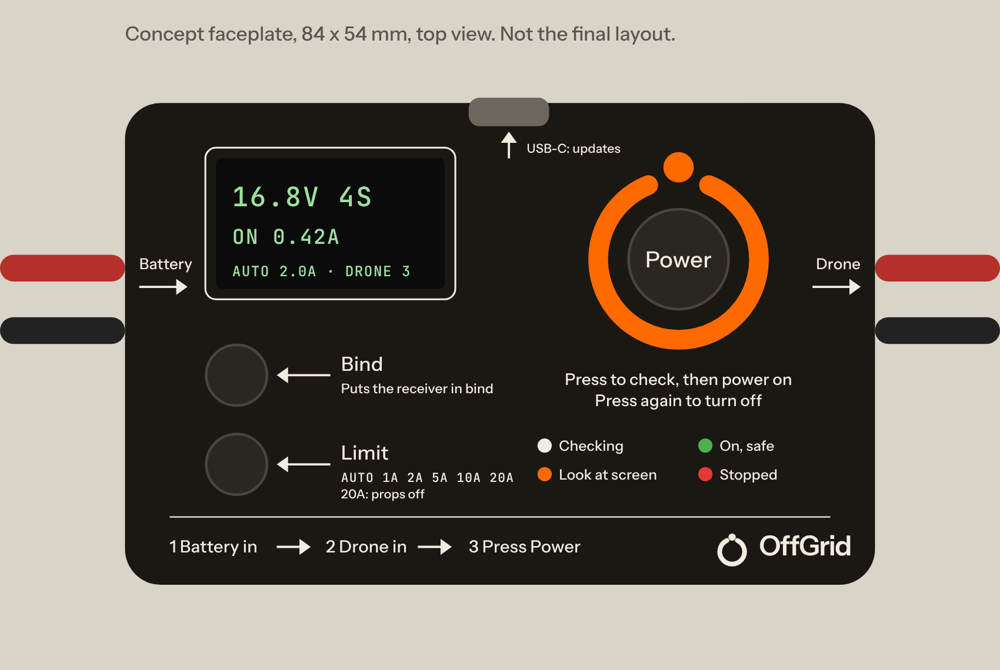

# SmokeBreak: a smoke stopper that checks before it powers

**Status: spec only.** Nothing is designed or built yet. This document is
what the schematic and the board will be built against. Research behind it
is in [`docs/research/market-and-complaints.md`](docs/research/market-and-complaints.md).
Name chosen by the owner, 10 Oct 2026; trademark search pending.



*Concept only: the final layout comes from the board generator.*

---

## 0. Decisions needed before we build

| # | Decision | Recommendation | Why it matters |
|---|---|---|---|
| D1 | Product name | **SmokeBreak** — decided (no FPV product of that name found, 10 Oct 2026) | Needs a USPTO class 9 search before any print run |
| D2 | Top of the voltage range | **14S (60.9 V LiHV)** — decided | 100 V switch parts, 64 V clamp (§9) |
| D3 | USB-C port | **Yes** — decided | Firmware updates, drone-memory export. +$0.40 (§12) |
| D4 | Front panel | **The PCB is the front panel**, behind a clear cover | The silkscreen instructions are the product's UI and stay on brand |
| D5 | Cost-down parts (§12) | **Take all five** | Brings landed cost from ≈ $14.30 to ≈ $10.50 with 14S and USB-C |
| D6 | Price | **$22.99** | ≈ 2.2 × landed cost; inside the smart band ($15–23) |

---

## 1. What it is

A box that sits between a LiPo and a drone on the bench. Plug both in and
press **Power**. Before any battery voltage reaches the drone, it:

1. **Probes the drone at 3 V** and finds dead shorts, half-shorts and
   **reversed leads** — without a battery's worth of current behind them.
2. **Charges the drone's capacitors slowly**, so there is no inrush and
   nothing to false-trip on.
3. **Turns the drone on** behind a tight electronic fuse, and tells you in
   words what it draws.

It also **remembers each drone** it has seen and warns when one draws more
than last time, or when its big capacitor has shrunk or gone.

One unit covers **1S whoops to 14S heavy-lift**.

## 2. What makes it different

Every smoke stopper today does one thing: apply full voltage and cut off
if current goes over 1 A or 2 A. Users are stuck choosing between false
trips (limit too low) and burnt parts (limit too high). SmokeBreak removes
that trade-off.

| What people complain about (ranked) | What SmokeBreak does |
|---|---|
| 1. False trips on healthy builds (inrush, ESC tones, digital VTX) | Soft pre-charge removes inrush entirely. Two-tier limit: a tight *average* limit plus a fast *peak* limit, so ESC tones pass and shorts don't |
| 2. False sense of security: green light, still smoked | 3 V probe finds the fault **before** battery voltage is applied; half-shorts (e.g. a failing 5 V regulator, ~20 Ω) are named and measured |
| 3. Can't spin motors through it | **20 A motor-test setting** (props off), 30 s window, with the peak fuse still armed |
| 4. Only 1 A / 2 A, set with solder pads | Six settings on a button (Auto, 1, 2, 5, 10, 20 A), changeable while on |
| 5. No 1S, nothing smart above 6S | **1S to 14S** in one unit. No smart competitor covers either end |
| 6. Confusing LEDs → "red meant good to go", burnt motor | A screen that says what happened in words, a status ring, beeps, and printed instructions on the face |
| 7. Dead on arrival, bare boards short on benches, leads rip off | Closed case, panel-mount battery connector, clamped drone lead, self-test at power-up |
| 8. XT30/XT60 only; won't reach a frame-mounted XT60 | XT60 and XT30 built in on both sides, flexible 10 cm drone leads, BT2.0 adapters in the box |
| Loved feature: the power button for binding | Kept, plus a **Bind** button that does the ELRS three-power-cycle for you |

Three things no product on the market does today:

- **Checks before it powers** (3 V probe: short, reversed, half-short).
- **No inrush, so no false trips**, even with a tight limit.
- **Remembers each drone** and warns when its draw or capacitor changes.

---

## 3. Headline specifications

| | Value |
|---|---|
| Battery | **1S–14S** LiPo, LiHV, Li-ion: **3.5–60.9 V** |
| Survives | Reversed battery to −61 V; 80 V input transients |
| Pre-check | 3 V probe, ≤ 30 mA, before any battery voltage reaches the drone |
| Detects before power | Dead short (< 1 Ω), half-short (1–150 Ω), reversed drone lead, missing bulk capacitor |
| Pre-charge | Through pulse-rated resistors (≈ 2 Ω for 1–7S, ≈ 22 Ω for 8–14S), up to 5,000 µF in < 1 s |
| Trip settings | Auto · 1 · 2 · 5 · 10 · 20 A (20 A = motor test, 30 s, props off) |
| Peak (short) cut-off | ≤ 5 µs at 4 × the setting (comparator), plus the driver's own short trip (speed to confirm, §14) |
| Through-resistance | ≤ 20 mΩ battery-to-drone through the XT60s |
| Current rating | 10 A continuous, 20 A for 30 s |
| Measures | Battery V (±1 %), drone current 0–40 A; idle current ±10 mA + 2 % (0.05–3 A) |
| Remembers | 32 drones (capacitance, idle current, cell count) |
| Connectors | Battery side: XT60 + XT30 **male**, panel-mount. Drone side: XT60 + XT30 **female** on 10 cm leads. BT2.0 adapters in the box |
| USB-C | Firmware update, drone-memory export, powers the screen for reading memory without a battery |
| UI | 0.96" screen, Beacon Ring status light, 3 buttons, beeper |
| Power use | ~30 mA on, < 30 µA off (battery still plugged in) |
| Size / weight | ~86 × 56 × 22 mm, ~60 g (bench tool; not for flying) |
| Price target | $22.99 retail; ≈ $10.50 landed cost at 1k (§12) |

---

## 4. How it powers a drone

Every press of **Power** runs the whole sequence. Nothing is skipped.

```
 battery in ─► [0 Idle] ─Power─► [1 Probe 3 V] ─pass─► [2 Pre-charge] ─pass─► [3 On]
                                    │ fail                │ fail                 │ over limit
                                    ▼                     ▼                      ▼
                                 [Stopped: reason, value, what to check]  ◄───────┘
```

### Stage 0 — Idle

- Battery detected: screen shows voltage and cell count ("16.8 V · 4S").
- Battery reversed into the device: nothing conducts; screen and beeper
  say "Battery reversed" (powered through the protection diode).
- Cell count is a guess from voltage; it is shown, never acted on silently.

### Stage 1 — 3 V probe (~0.3 s)

The main switch stays **off**. A 3.0 V source drives the drone's power
lead through 1 kΩ, then through 100 Ω. The device reads the drone's
voltage at both currents and the rise time.

| Reading | Verdict |
|---|---|
| Stays below 50 mV at both currents | **Short** (resistance shown) |
| Settles between, scales with the source resistor | **Half-short**, resistance shown (e.g. "18 Ω") |
| Clamps at 0.9–1.6 V and barely moves between the two currents | **Reversed lead**: the ESC's FET body diodes are conducting |
| Charges up like a capacitor | **Pass.** The rise time gives the drone's capacitance |
| Capacitance under 100 µF on 4S or more | Pass, with a warning: "No big capacitor found" |

**Why reversed leads show up:** with the drone's red and black swapped,
the probe's current flows through each half-bridge's two body diodes in
series, so the voltage clamps at about two diode drops. A resistor scales
with current; a diode barely moves. That is why two probe currents are used.

**1S exception:** 1S flight controllers start running near 3 V, so they look
like a load. On 1S the half-short verdict is replaced by a softer limit
(below 10 Ω only) and the pre-charge stage does the rest.

### Stage 2 — Pre-charge at battery voltage (≤ 1 s)

- A small switch connects the drone through pulse-rated pre-charge
  resistors. The resistors, not a transistor, take the charging energy,
  so this holds at 14S. Two values, picked by cell count: about 2 Ω for
  1–7S and about 22 Ω for 8–14S. That is low enough for a drone whose
  digital VTX switches on part-way up (≈ 10–15 W) to still climb past
  75 % of battery voltage. Peak current is a few amps for a few
  milliseconds, against hundreds of amps when a battery is plugged in
  directly.
- The device watches the voltage and current all the way up.
- **Abort** if the drone's voltage stops rising below 75 % while current
  flows (a fault that appears only at higher voltage, e.g. a 5 V part on
  battery voltage), or the ramp takes over 1 s. The screen shows at what
  voltage and current it stopped.
- **Pass** above 75 % of battery voltage. The main switch then turns on
  over about 50 ms and closes the rest of the gap: no spark, and the
  remaining charge current stays well under the trip limit.

### Stage 3 — On

- Ring turns green. Screen shows live current.
- After 10 s, idle current is recorded and compared with this drone's last
  visit (§7).
- **Two-tier limit:**
  - **Average limit** = the setting, averaged over 200 ms. ESC start-up
    tones and VTX boot spikes pass.
  - **Peak limit** = 4 × the setting, cut off in ≤ 5 µs by a hardware
    comparator. Real shorts never get near the average.
  - **Short-circuit trip** in the driver chip, at a fixed threshold,
    whatever the firmware is doing.
- Trip reason is always shown: "Over 2 A for 0.2 s (peak 2.6 A)" or
  "Spike over 8 A".

---

## 5. Protection layers

From the fastest, independent of firmware, to the smartest:

1. **Short-circuit trip** in the high-side driver (TPS4800-Q1 class): a
   fixed hardware threshold. Works with the MCU halted.
2. **Programmable peak comparator:** MCU sets the threshold (4 × setting),
   the comparator pulls the switch off directly, ≤ 5 µs.
3. **Firmware average limit:** current sampled at ≥ 10 kHz, 200 ms window.
4. **Pre-charge abort:** voltage-versus-time watch during the ramp.
5. **3 V probe:** no battery current behind it at all.
6. **Back-to-back MOSFETs:** blocks current both ways when off; a reversed
   battery or a drone with its own battery plugged in cannot back-feed.
7. **Thermal:** NTC at the switch; firmware cuts at 100 °C and limits the
   20 A window. The pre-charge resistors have an energy budget per attempt.
8. **Self-test at power-up:** switch off-state leakage, probe source and
   comparator checked; a failed self-test locks the switch off and says so.

---

## 6. User interface

### The face

The circuit board is the front panel: matte black (Pitch), white
silkscreen (Bone), behind a clear 1 mm polycarbonate cover. Everything
you press or read is on the top face, away from the leads, so it can be
held in one hand and pressed with the thumb.

- **Power** — the big button (12 mm cap) in the centre of the **Beacon
  Ring** light, the brand mark as a light pipe.
- **Bind** and **Limit** — two smaller buttons (8 mm caps) on the left,
  each with its function printed beside it.
- **Screen** top left. **Status legend** under the ring.
- **Steps** printed along the bottom edge.
- Battery comes in on the left end, the drone leaves on the right end.

### Buttons — one job each, no hidden holds

| Button | Press | While stopped |
|---|---|---|
| **Power** | Off → full check → on. On → off | Clears the fault and re-runs the full check |
| **Bind** | Runs ELRS bind: on, off within 2 s, three times, stays on. Each cycle is protected; the probe runs on the first | — |
| **Limit** | Steps Auto → 1 → 2 → 5 → 10 → 20 A → Auto. Works while on | Same |

Going to **20 A** asks for a second press within 3 s ("Props off? Press
Limit again"). After 30 s at 20 A it drops back to the previous setting.

### Status ring

| Colour | Meaning |
|---|---|
| White, turning | Checking |
| Green | On, all good |
| Ember (orange) | On, but something changed since last time — look at the screen |
| Red, flashing | Stopped — read the screen |
| Blue, pulsing | Bind sequence |

### Beeps

One short = on. Two short = warning. One long = stopped. Rising = bind
done. The beeper cannot be muted in v1: it is a safety device.

### Screen messages (draft wording)

| Screen | Second line |
|---|---|
| `16.8V 4S` | Press Power |
| Checking… | 3 V probe |
| **SHORT 0.3 Ω** | Don't plug a battery in directly. Find the short |
| **REVERSED** | Red and black swapped on the drone lead |
| **HALF-SHORT 18 Ω** | Often a failed 5 V regulator or VTX |
| **NO BIG CAP** | 4S+ drones need one on the ESC |
| **STOPPED AT 6.1 V** | Drew 1.9 A while charging. Something on the battery line can't take battery voltage |
| ON 0.42 A | Limit Auto (2.0 A) · Drone 3 |
| **MORE THAN LAST TIME** | 0.42 → 0.71 A |
| **CAP SMALLER** | 1000 → 210 µF. Check the ESC capacitor |
| **STOPPED** | Over 2 A for 0.2 s (peak 2.6 A) |
| **STOPPED** | Spike over 8 A |
| Battery reversed | Unplug it |
| Battery low | 3.4 V per cell |

### Silkscreen text and arrows (top face)

**Rule: noob-proof.** Someone who has never seen one should get it right
first time from the face alone, without the manual. Arrows do most of
the explaining; words are short and plain.

One arrow, used everywhere: the brand arrow from Ridge 3 (`arrow_mm` in
`ridge-3/src/brand.py`), a thin flat 0.25 mm line with a solid head. Same
size and shape wherever it is printed, so it always reads the same.
Clean and quiet, never decorative.

| Where | Arrow | Words |
|---|---|---|
| Left end, at the battery inputs | Points **into** the box | "Battery" |
| Right end, at the drone leads | Points **out of** the box | "Drone" |
| Back edge, at USB-C | Points to the port | "USB-C: updates" |
| Bind button | From the label to the button | "Bind" / "Puts the receiver in bind" |
| Limit button | From the label to the button | "Limit" / `AUTO 1A 2A 5A 10A 20A` / "20A: props off" |
| Bottom strip | Between the steps | "1 Battery in → 2 Drone in → 3 Press Power" |

The Power button needs no arrow: the ring is the biggest thing on the
face. Under it: "Press to check, then power on" / "Press again to turn off".

Also printed:

- Ring legend: "Checking · On, safe · Look at screen · Stopped", each with
  its colour dot.
- "Bench use only. Do not fly with this attached." (on the case's end).
- Lockup (mark + "OffGrid"), product name, `REV 1.0`, serial in mono.

Type: sentence case, Instrument Sans 500; numbers and units in JetBrains
Mono 500, uppercase (brand rules, as on Ridge 3).

The concept render is made by `images/concept_faceplate.py`.

---

## 7. Drone memory

The 3 V probe measures each drone's capacitance before it is powered.
Capacitance (mostly the ESC's bulk capacitor) differs from drone to drone,
so together with cell count it identifies a drone without any setup.

- **Stored per drone:** capacitance, idle current at 10 s, cell count,
  date of last visit. 32 drones, oldest dropped first.
- **Match:** same cell count and capacitance within ±15 %. No match = new
  drone ("Drone 7, new").
- **Warnings** (ring turns Ember, screen explains):
  - Idle current up by more than 30 % and 0.1 A: dying regulator, VTX,
    water damage, a motor dragging.
  - Capacitance down by more than 30 %: capacitor broken off, dried or
    open. This kills ESCs on the next hard flight.
- **Auto limit** uses the memory: for a known drone, average limit =
  1.5 × its idle current, at least idle + 0.5 A, clamped 0.5–5 A. For a
  new drone: 1 A on 1S, 3 A on 2S and up.

---

## 8. Connectors

**Rule: male on the battery side, female on the drone side.** In FPV the
battery carries the female connector and the drone carries the male. The
device copies both, so it drops in between with nothing to adapt, and its
live output is always the female side, whose contacts are recessed.

| Side | Built in | Gender | Why |
|---|---|---|---|
| Battery in (left end) | XT60 + XT30, panel-mounted (Amass XT60PW / XT30PW class) | **Male** | Mates the battery's female. Mounted in the case: no lead to rip off |
| Drone out (right end) | XT60 + XT30, each on a 10 cm 14 AWG silicone lead, clamped | **Female** | Mates the drone's male. Flexible enough for frame-mounted XT60s |
| In the box | BT2.0 pair: BT2.0 male → XT30 female (battery), XT30 male → BT2.0 female (drone) | — | 1S whoops |
| Accessory | XT90 pair and AS150U pair, same pattern | — | 8–14S heavy-lift |

- XT60 and XT30 between them cover almost every 2–8S FPV build, so most
  users never need an adapter.
- Only one input may be used at a time. The unused input's pins are
  live but recessed in their shroud (as on ShortSaver 2); the case puts a
  rib between the two so a stray wire cannot bridge them.
- Adapter resistance does not matter at bench currents.

---

## 9. Electronics

### Block diagram

```
 XT60/XT30 in ─┬─ TVS ─ [FET A]─[FET B] ──────┬──────────────── XT60/XT30 out (+)
               │        back-to-back          │
               │   ┌─ switch + pre-charge R ──┤
               │   │                          ├─ 3 V probe (1 kΩ / 100 Ω, 100 V diode)
               │   high-side driver           ├─ voltage sense (0–65 V and 0–3.3 V ranges)
               │   (charge pump, own short    │
               │    trip, reverse protect)    │
               │        ▲                     │
               │        └── peak comparator ◄── op-amp ◄── shunt in the negative lead ◄── out (−)
               │
               └─ reverse-protected 3.0–65 V buck ─┐
                                   USB-C 5 V ──────┴─► 3.3 V ─► MCU ─► screen, ring LEDs,
                                                                     buttons, beeper, NTC, USB
```

### Candidate parts (to be confirmed at schematic stage)

| Function | Candidate | Notes |
|---|---|---|
| High-side driver | **TI TPS4800-Q1** | 3.5–80 V (100 V abs max), integrated charge pump, reverse-polarity protection, its own short-circuit trip. One gate output, which is all this design needs |
| Main switch | 2 × 100 V N-MOSFET, ≤ 6 mΩ, 5 × 6 mm | Two makers qualified (e.g. Infineon and onsemi/Vishay) so price can be bid |
| Pre-charge | Small 100 V switch + two pulse-rated resistor banks (≈ 2 Ω and ≈ 22 Ω), picked by cell count | The resistors take the ≈ 9 J at 14S, not a transistor |
| Shunt | 2 mΩ, 2512, 3 W, **in the negative lead** | Low-side, so any $0.10 op-amp reads it; 0.8 W at 20 A |
| Current amp | Precision op-amp, gain ≈ 50, auto-zeroed before each power-on | ±10 mA idle figure |
| Peak comparator | Push-pull comparator, MCU-set threshold | Output pulls the driver's input low directly |
| Aux supply | **TI LMR36503** buck, 3.0–65 V in | 1S–14S. Fed through an RC filter and its own clamp, so input spikes stay under its 70 V limit |
| MCU | ST **STM32C071** | USB without a crystal, 12-bit ADC, non-PRC maker |
| USB-C | 16-pin receptacle + ESD array | Data and 5 V. **The drone output stays off while USB is connected to a computer** (§14) |
| Screen | 0.96" 128 × 64 OLED, I²C | |
| Status ring | 3 × addressable RGB LED (2020 size) under a ring light pipe | |
| Input clamp | 64 V stand-off TVS (SMBJ64A class) | Clears 14S LiHV at 60.9 V |
| Buttons | 1 × 12 mm and 2 × 6 mm tactile, top side, with caps | |

### Board

- Two layers, 2 oz copper; power path on the bottom, top side kept clean
  as the face (only the screen, buttons, LEDs and silkscreen).
- Built with the repository's generator and verification gates, like
  `packet-logger-carrier` and Ridge 3.
- Programming and test pads on the bottom, reachable with the case open;
  everyday updates go over USB-C.

---

## 10. Mechanical

- **Case:** a base tray plus the board as the lid, a clear 1 mm
  polycarbonate cover over the face, four screws. First batch printed
  (MJF nylon, black); injection-moulded from the second batch.
- **Ends:** XT60 and XT30 (male) through the left end with a rib between
  them; the two drone leads through clamped grommets on the right end;
  USB-C on the back edge, away from the leads.
- **Underside:** rubber feet; fully closed so it cannot short on a
  conductive bench.
- **Light pipe:** clear or frosted ring in the shape of the Beacon Ring,
  the node at 12 o'clock.
- STEP model exported by the generator for case design, as for the
  carrier board.

---

## 11. Brand

Taken from the existing boards (`packet-logger-carrier`, Ridge 3):

- **Pitch** `#1B1813` matte black solder mask; **Bone** `#F1ECE0` white
  silkscreen; **Ember** `#FF6A00` as light, not ink: the ring's caution
  colour and the Beacon Ring itself.
- Labels: Instrument Sans 500, sentence case, never bold. Numbers, units
  and codes: JetBrains Mono 500, uppercase. Weight 600 belongs to the
  wordmark only.
- Horizontal lockup (mark + "OffGrid") bottom right; `REV` and serial in
  mono.
- ENIG gold on exposed pads, as on Ridge 3.

---

## 12. Cost and price

Estimates at 1,000 units, before quotes. "First spec" is the version
committed first (12S, no USB); "this spec" is 14S with USB-C and the
cost-down parts.

| Item | First spec | This spec | Change | What it costs us |
|---|---|---|---|---|
| Switch driver | TPS48111 $2.00 | TPS4800-Q1 ~$1.00 (est.) | −$1.00 | Its pre-charge driver and current monitor; both done another way below |
| Pre-charge | Linear-mode FET + R $0.35 | Small switch + pulse resistors $0.30 | −$0.05 | Nothing; **removes the biggest design risk** at 14S |
| Current sense | 80 V+ high-side amp $1.20 | Low-side shunt + op-amp $0.25 | −$0.95 | Output must stay off while USB is connected (§14) |
| Main FETs (2) | ≤ 4 mΩ, one maker $1.40 | ≤ 6 mΩ, two makers $0.70 | −$0.70 | Motor test 25 A/60 s → 20 A/30 s (props-off spin rarely needs 10 A) |
| Status LEDs | 6 × RGB $0.40 | 3 × addressable $0.15 | −$0.25 | None visible through the light pipe |
| Case | Printed $1.50 | Injection-moulded $0.80 | −$0.70 | ~$5k tool, from the second batch |
| Box contents | XT30 + BT2.0 adapter pairs $1.40 | BT2.0 pair only $0.80 | −$0.60 | XT30 is now built in |
| Connectors | XT60 in + XT60 lead $1.10 | XT60 + XT30 both sides $1.50 | +$0.40 | — |
| 14S clamp + buck filter | — | $0.05 | +$0.05 | — |
| USB-C + USB MCU | — | $0.40 | +$0.40 | — |
| Aux buck, screen, buttons, beeper, passives, NTC, TVS | $2.75 | $2.75 | — | — |
| PCB + assembly | $1.70 | $1.60 | −$0.10 | Fewer parts |
| **Total** | **≈ $14.30** | **≈ $10.50** | **−$3.80** | First batch, printed case: ≈ $11.20 |

(The first spec's own summary said ≈ $13; itemising it gives $14.30.)

Market: polyfuse $5–8; smart $15–23 (ShortSaver 2 $16–17, SpeedyBee
≈ $20–23, 4–6S only).

- **$22.99** is ≈ 2.2 × landed cost and sits inside the smart band, with
  1S–14S, which none of them cover.
- **$19.99** works direct-to-customer (1.9 ×) but leaves little for
  retailers.

Further cuts, not recommended: a 0.91" 128 × 32 screen (−$0.40, two lines
of text instead of three); one MOSFET instead of two (−$0.35, loses
reversed-battery and back-feed blocking); a discrete gate driver instead
of the TPS4800 (−$0.80, loses the short trip that works with the MCU
halted).

---

## 13. Compliance

- No radio. In the US it needs an FCC Part 15B Supplier's Declaration of
  Conformity as an unintentional radiator (USB-C does not change that).
  CE/UKCA (EMC + RoHS) for Europe.
- It is ground test equipment that never flies, so the FCC Covered List
  entry for "UAS critical components" (Ridge 3 research) should not apply.
  **Confirm before launch.**
- LiPo safety wording on the box and the face: bench use only, props off
  for the 20 A setting, never leave unattended.

---

## 14. Risks and open questions

1. **Pre-charge resistor energy.** Charging 5,000 µF to 60.9 V puts
   ≈ 9.3 J into the resistors in under 1 s. Size them from their pulse
   curves and limit retries (energy budget per minute).
2. **USB ground path.** The shunt is in the negative lead. If this device
   and the drone were both plugged into the same computer, fault current
   could return through the two USB cables, bypassing the shunt and
   passing through the computer. So the drone output is held off while
   this device's USB is connected to a host (5 V-only chargers are fine).
   The driver's own short trip does not use the shunt and still works.
3. **Probe on 1S.** 1S flight controllers run near 3 V. Measure real whoops
   before fixing the 1S thresholds.
4. **Reversed-lead signature** on AIO boards with a reverse-protection
   diode or ideal-diode chip: they will look "open". Test on several boards;
   the pre-charge stage still stops a reversed drone at low current.
5. **Capacitance fingerprint repeatability** across temperature and
   capacitor age. Bench data needed before promising "remembers".
6. **TPS4800-Q1 price and short-trip speed** are not yet confirmed from
   its datasheet. Fallback: TPS48110-Q1 (+$0.80).
7. **Name** needs a trademark search (the Ridge 3 research already found
   "OFFGRID" registered in class 9 by another company).

---

## 15. How v1 will be proven

Before a second batch, each of these passes on the bench:

| Test | Pass |
|---|---|
| Dead short (10 mΩ) on the output, 1S–14S | Probe stops it; zero battery current |
| 18 Ω and 100 Ω half-shorts | Named, resistance within 10 % |
| Reversed lead on 3 different ESCs and 2 AIOs | "Reversed" on every one, or stopped in pre-charge |
| 2,000 µF + 470 µF at 6S, 5,000 µF at 14S | No trip, pre-charge resistors within their pulse rating |
| ESC start-up tones, O4 + 6S, Walksnail + 6S | No trip on Auto |
| O4 Pro on 3S and 7S, Walksnail on 14S heavy-lift | Pre-charge passes 75 %, then on |
| Short applied while on, at each setting | Off in ≤ 5 µs (scope) |
| 20 A for 30 s | Switch < 100 °C, drops back after 30 s |
| Reversed battery to −61 V | No damage, message shown |
| USB-C connected to a laptop | Output refuses to turn on; screen says why |
| Same drone, 10 plug-ins over a week | Recognised every time |
| ELRS 3.x receiver, Bind button | Enters bind on every try |
| MCU held in reset, short applied | Driver's own trip still cuts off |

---

## 16. Not in v1

- A native XT90 version.
- **Pro version:** an in-line unit for 8–14S heavy-lift that stays
  connected in flight as an anti-spark switch and runs the same pre-check
  at every power-up. Anti-spark filters (~$15) don't detect shorts and
  smoke stoppers can't be flown through; nothing does both today.
- Battery internal-resistance test, phone app.
